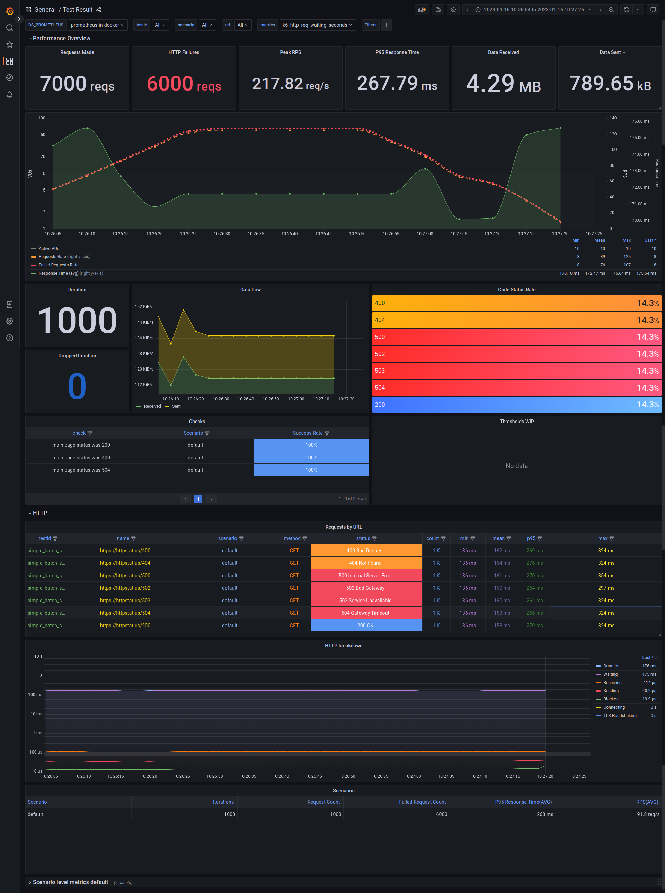

# xk6-output-prometheus-remote

[k6](https://github.com/grafana/k6) extension for publishing test-run metrics to Prometheus via Remote Write endpoint.

> :warning: Not to be confused with [Prometheus Remote Write **client** extension](https://github.com/grafana/xk6-client-prometheus-remote) which is for load testing _Prometheus_ itself.

> :bookmark: As of k6 v0.42.0, this extension is available within k6 as an _experimental module_.
> This means that the extension has entered the process of being fully merged into the core of k6 and does not require a special build with xk6 to utilize this feature.
>
> See the [Prometheus remote write guide](https://k6.io/docs/results-output/real-time/prometheus-remote-write/) to utilize this feature.
>

There are many options for remote-write compatible agents, the official list can be found [here](https://prometheus.io/docs/operating/integrations/). The exact details of how metrics will be processed or stored depends on the underlying agent used.

Key points to know:

- remote write format does not contain explicit definition of any metric types while metadata definition is still in flux and can have different implementation depending on the remote-write compatible agent
- remote read is a separate interface and it is much less defined. For example, remote read may not work without precise queries; see [here](https://prometheus.io/docs/prometheus/latest/storage/#remote-storage-integrations) and [here](https://github.com/timescale/promscale/issues/64) for details
- some remote-write compatible agents may support additional formats for remote write, like JSON, but it is not part of official Prometheus remote write specification and therefore absent here

### Usage

To build k6 binary with the Prometheus remote write output extension use:
```
xk6 build --with github.com/grafana/xk6-output-prometheus-remote@latest 
```

Then run new k6 binary with the following command for using the default configuration (e.g. remote write server url set to `http://localhost:9090/api/v1/write`):
```
./k6 run -o xk6-prometheus-rw script.js 
```

Check [the documentation](https://k6.io/docs/results-output/real-time/prometheus-remote-write) for advanced configurations.

### Docker Compose

This repo includes a [docker-compose.yml](./docker-compose.yml) file that starts _Prometheus_, _Grafana_, and a custom build of _k6_ having the `xk6-output-prometheus-remote` extension.

Note: the `docker-compose.yml` file has the Native Histogram mapping set as enabled.

> This is just a quick setup to show the usage. For a real use case, you will want to deploy outside of docker.

Clone the repo to get started and follow these steps:

1. Start the docker compose environment.

    ```shell
    docker-compose up -d
    ```

    > Some users have encountered failures for the k6 build portion. A workaround may be to disable the _"Use Docker Compose V2"_ checkbox in the _General_ section of Docker Desktop settings.

    ```shell
    # Output
    Creating xk6-output-prometheus-remote_grafana_1     ... done
    Creating xk6-output-prometheus-remote_prometheus_1  ... done
    Creating xk6-output-prometheus-remote_k6_1          ... done
    ```

2. Use the k6 Docker image to run the k6 script and send metrics to the Prometheus container started on the previous step. You must [set the `testid` tag](https://k6.io/docs/using-k6/tags-and-groups/#test-wide-tags) with a unique identifier to segment the metrics into discrete test runs for the Grafana dashboards.

    ```shell
    docker-compose run --rm -T k6 run -<samples/test.js --tag testid=<SOME-ID>
    ```

    For convenience, the `docker-run.sh` can be used to simply:

    ```shell
    ./docker-run.sh samples/test.js
    ```

3. Visit <http://localhost:3000/> to view results in Grafana.

## Dashboards

[](./images/prometheus-dashboard-k6-test-result.png)

The docker-compose setup comes with some pre-built Grafana dashboards. Check the [dashboard guide](/grafana/dashboards) for details.

>Note: The dashboards work with the Native Histogram mapping so it is required to enable it.
