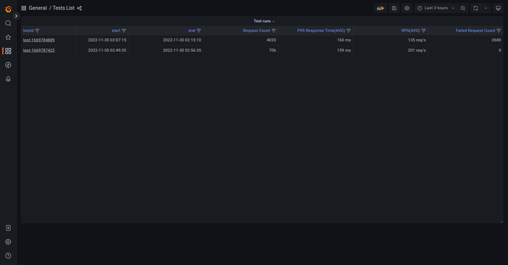

# xk6-output-prometheus-remote
[k6](https://github.com/grafana/k6) extension for publishing test-run metrics to Prometheus via Remote Write endpoint.

> :warning: Not to be confused with [Prometheus Remote Write **client** extension](https://github.com/grafana/xk6-client-prometheus-remote) which is for load testing _Prometheus_ itself.

There are many options for remote-write compatible agents, the official list can be found [here](https://prometheus.io/docs/operating/integrations/). The exact details of how metrics will be processed or stored depends on the underlying agent used.

Key points to know:

- remote write format does not contain explicit definition of any metric types while metadata definition is still in flux and can have different implementation depending on the remote-write compatible agent
- remote read is a separate interface and it is much less defined. For example, remote read may not work without precise queries; see [here](https://prometheus.io/docs/prometheus/latest/storage/#remote-storage-integrations) and [here](https://github.com/timescale/promscale/issues/64) for details
- some remote-write compatible agents may support additional formats for remote write, like JSON, but it is not part of official Prometheus remote write specification and therefore absent here

### Usage

To build k6 binary with the Prometheus remote write output extension use:
```
xk6 build --with github.com/grafana/xk6-output-prometheus-remote@latest 
```

Then run new k6 binary with:
```
K6_PROMETHEUS_RW_SERVER_URL=http://localhost:9090/api/v1/write ./k6 run -o xk6-prometheus-rw script.js 
```

Add TLS and HTTP basic authentication:
```
K6_PROMETHEUS_RW_SERVER_URL=https://localhost:9090/api/v1/write \
K6_PROMETHEUS_RW_INSECURE_SKIP_TLS_VERIFY=false \
K6_PROMETHEUS_RW_USERNAME=foo \
K6_PROMETHEUS_RW_PASSWORD=bar \
./k6 run -o xk6-prometheus-rw script.js 
```

### Metric types conversions

All the k6 metric types are converted into an equivalent Prometheus' type:

| k6 | Prometheus |
|----|------------|
| Counter | Counter |
| Gauge | Gauge |
| Rate | Gauge |
| Trend | Gauges / Native Histogram |

The obvious conversion with a classic Prometheus Histogram is not convenient because k6 can't determine the fixed buckets in advance, so the Output maps a Trend metric by default into 8 Gauges where each value represents a math function (count, sum, min, max, avg, med, p95).
Mapping Trend by Gauges has the following cons:
* It is impossible to aggregate some Gauge's value (especially the percentiles).
* It uses a memory-expensive k6's data structure.

The previous points can be resolved by mapping Trend as [Prometheus Native Histogram](https://prometheus.io/docs/concepts/metric_types/#histogram). Enabling the conversion by the `K6_PROMETHEUS_RW_TREND_AS_NATIVE_HISTOGRAM=true` environment variable (or one of the other ways), then the Output converts all the Trend types into a dedicated Native Histogram.

Native Histogram is a Prometheus' experimental feature, so it has to be enabled (`--enable-feature=native-histograms`). Note that other Remote-write implementations don't support it yet.

### Prometheus as remote-write agent

To enable remote write in Prometheus 2.x use `--enable-feature=remote-write-receiver` option. See docker-compose samples in `example/`. Options for remote write storage can be found [here](https://prometheus.io/docs/operating/integrations/). 


### Docker Compose

This repo includes a [docker-compose.yml](./docker-compose.yml) file that starts _Prometheus_, _Grafana_, and a custom build of _k6_ having the `xk6-output-prometheus-remote` extension.

Note: the `docker-compose.yml` file has the Native Histogram mapping set as enabled.

> This is just a quick setup to show the usage. For a real use case, you will want to deploy outside of docker.

Clone the repo to get started and follow these steps: 

1. Start the docker compose environment.
    ```shell
    docker-compose up -d
    ```
    
    > Some users have encountered failures for the k6 build portion. A workaround may be to disable the _"Use Docker Compose V2"_ checkbox in the _General_ section of Docker Desktop settings.

    ```shell
    # Output
    Creating xk6-output-prometheus-remote_grafana_1     ... done
    Creating xk6-output-prometheus-remote_prometheus_1  ... done
    Creating xk6-output-prometheus-remote_k6_1          ... done
    ```

2. Use the k6 Docker image to run the k6 script and send metrics to the Prometheus container started on the previous step. You must [set the `testid` tag](https://k6.io/docs/using-k6/tags-and-groups/#test-wide-tags) with a unique identifier to segment the metrics into discrete test runs for the Grafana dashboards.
    ```shell
    docker-compose run --rm -T k6 run -<samples/test.js --tag testid=<SOME-ID>
    ```
    For convenience, the `docker-run.sh` can be used to simply:
    ```shell
    ./docker-run.sh samples/test.js
    ```

3. Visit http://localhost:3000/ to view results in Grafana.

## Dashboards

The docker-compose setup comes with two pre-built dashboards. One for listing the discrete test runs as a list, and the other for visualizing the results of a specific test run.

### Test list dashboard



### Test result dashboard


