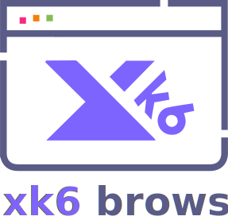

<p align="center"><a href="https://k6.io/"></a></p>

<h3 align="center">Like unit testing, for performance</h3>
<p align="center">A modern load testing tool for developers and testers in the DevOps era.</p>

<p align="center">
  <a href="https://github.com/loadimpact/k6/releases"></a>
  <a href="https://circleci.com/gh/loadimpact/k6/tree/master"></a>
  <a href="https://goreportcard.com/report/github.com/loadimpact/k6"></a>
  <a href="https://codecov.io/gh/loadimpact/k6"></a>
  <br>
  <a href="https://twitter.com/k6_io"></a>
  <a href="https://k6.io/slack"></a>
</p>
<p align="center">
    <a href="https://github.com/loadimpact/k6/releases">Download</a> ·
    <a href="#install">Install</a> ·
    <a href="https://k6.io/docs">Documentation</a> ·
    <a href="https://community.k6.io/">Community</a>
</p>

<br/>

<br/>

**k6** is a modern load testing tool, building on [Load Impact](https://loadimpact.com/)'s years of experience in the load and performance testing industry. It provides a clean, approachable scripting API, [local](https://k6.io/docs/getting-started/running-k6) and [cloud execution](https://k6.io/docs/cloud), and flexible configuration.

This is how load testing should look in the 21st century.

<p align="center">
  
</p>

Menu
----

- [Features](#features)
- [Install](#install)
- [Running k6](#running-k6)
- [Overview](#overview)
- [Need help or want to contribute?](#contributing)

Features
--------

- **Scripting in ES6 JS**: support for [modules](https://k6.io/docs/using-k6/modules) to aid code reusability across an organization
- **Everything as code**: test logic and [configuration options](https://k6.io/docs/using-k6/options) are both in JS for version control friendliness
- **Automation-friendly**: [checks](https://k6.io/docs/using-k6/checks) (like asserts) and [thresholds](https://k6.io/docs/using-k6/thresholds) for easy and flexible CI configuration!
- [**HTTP/1.1**](https://k6.io/docs/using-k6/http-requests), [**HTTP/2**](https://k6.io/docs/using-k6/protocols/http-2), [**WebSocket**](https://k6.io/docs/using-k6/protocols/websockets) and [**gRPC**](https://k6.io/docs/using-k6/protocols/grpc) protocol support
- **TLS features**: [client certificates](https://k6.io/docs/using-k6/protocols/ssl-tls/ssl-tls-client-certificates), [configurable SSL/TLS versions and ciphers](https://k6.io/docs/using-k6/protocols/ssl-tls/ssl-tls-version-and-ciphers)
- **Batteries included**: [Cookies](https://k6.io/docs/using-k6/cookies), [Crypto](https://k6.io/docs/javascript-api/k6-crypto), [Custom metrics](https://k6.io/docs/using-k6/metrics#custom-metrics), [Encodings](https://k6.io/docs/javascript-api/k6-encoding), [Environment variables](https://k6.io/docs/using-k6/environment-variables), JSON, [HTML forms](https://k6.io/docs/using-k6/html/working-with-html-forms), [files](https://k6.io/docs/javascript-api/init-context/open-filepath-mode), [flexible execution control](https://k6.io/docs/getting-started/running-k6#section-stages-ramping-updown-vus), and more.
- **Built-in HAR converter**: record browser sessions as [`.har` files](https://en.wikipedia.org/wiki/.har) and [directly convert them to k6 scripts](https://k6.io/docs/using-k6/session-recording-har-support)
- **Flexible metrics storage and visualization**: [InfluxDB](https://k6.io/docs/results-visualization/influxdb-+-grafana) (+Grafana), [JSON](https://k6.io/docs/getting-started/results-output/json) or [k6 Cloud](https://k6.io/docs/cloud/analyzing-results/overview)
- [**Cloud execution**](https://k6.io/docs/using-k6/cloud-execution) and distributed tests _(currently only on infrastructure managed by [Load Impact](https://loadimpact.com/), with native distributed execution in k6 [planned](https://github.com/loadimpact/k6/wiki/Roadmap) for the near future!)_

There's even more! [See all features available in k6.](https://k6.io/docs/)

Install
-------

### Mac

Install with [Homebrew](https://brew.sh/) by running:

```bash
brew install k6
```

### Windows

You can manually download and install the [official `.msi` installation package](https://dl.bintray.com/loadimpact/windows/k6-v0.29.0-amd64.msi) or, if you use the [chocolatey package manager](https://chocolatey.org/), follow [these instructions](https://bintray.com/repo/buildSettings?repoPath=%2Floadimpact%2Fchoco) to set up the k6 repository.

### Linux

For Debian-based Linux distributions, you can install k6 from the private deb repo like this:

```bash
sudo apt-key adv --keyserver hkp://keyserver.ubuntu.com:80 --recv-keys 379CE192D401AB61
echo "deb https://dl.bintray.com/loadimpact/deb stable main" | sudo tee -a /etc/apt/sources.list
sudo apt-get update
sudo apt-get install k6
```

And for rpm-based ones like Fedora and CentOS:

```bash
wget https://bintray.com/loadimpact/rpm/rpm -O bintray-loadimpact-rpm.repo
sudo mv bintray-loadimpact-rpm.repo /etc/yum.repos.d/
sudo dnf install k6   # use yum instead of dnf for older distros
```

### Docker

```bash
docker pull loadimpact/k6
```

### Pre-built binaries & other platforms

If there isn't an official package for your operating system or architecture, or if you don't want to install a custom repository, you can easily grab a pre-built binary from [the GitHub Releases page](https://github.com/loadimpact/k6/releases). Once you download and unpack the release, you can optionally copy the `k6` binary it contains somewhere in your `PATH`, so you are able to run k6 from any location on your system.

### Build from source

k6 is written in Go, so it's just a single statically-linked executable and very easy to build and distribute. To build from source you need **[Git](https://git-scm.com/downloads)** and **[Go](https://golang.org/doc/install)** (1.12 or newer). Follow these instructions:

- Run `go get github.com/loadimpact/k6` which will:
  - git clone the repo and put the source in `$GOPATH/src/github.com/loadimpact/k6`
  - build a `k6` binary and put it in `$GOPATH/bin`
- Make sure you have `$GOPATH/bin` in your `PATH` (or copy the `k6` binary somewhere in your `PATH`), so you are able to run k6 from any location.
- Tada, you can now run k6 using `k6 run script.js`

Running k6
----------

k6 works with the concept of **virtual users** (VUs) that execute scripts - they're essentially glorified, parallel `while(true)` loops. Scripts are written using JavaScript, as ES6 modules, which allows you to break larger tests into smaller and more reusable pieces, making it easy to scale tests across an organization.

Scripts must contain, at the very least, an exported `default` function - this defines the entry point for your VUs, similar to the `main()` function in many languages. Let's create a very simple script that makes an HTTP GET request to a test website:

```js
import http from "k6/http";

export default function() {
    let response = http.get("https://test-api.k6.io");
};
```

The script details and how we can extend and configure it will be explained below, but for now simply save the above snippet as a `script.js` file somewhere on your system. Assuming that you've [installed k6](#install) correctly, on Linux and Mac you can run the saved script by executing `k6 run script.js` from the same folder. For Windows the command is almost the same - `k6.exe run script.js`.

If you decide to use the [k6 docker image](https://hub.docker.com/r/loadimpact/k6/), the command will be slightly different. Instead of passing the script filename to k6, a dash is used to instruct k6 to read the script contents directly via the standard input. This allows us to to avoid messing with docker volumes for such a simple single-file script, greatly simplifying the docker command: `docker run -i loadimpact/k6 run - <script.js`.

In some situations it may also be useful to execute remote scripts. You can do that with HTTP**S** URLs in k6 by [importing them](https://k6.io/docs/using-k6/modules#section-remote-modules) in the script via their URL or simply specifying their URL in the CLI command: `k6 run github.com/loadimpact/k6/samples/http_2.js` (k6 "knows" a bit about github and cdnjs URLs, so this command is actually shorthand for `k6 run raw.githubusercontent.com/loadimpact/k6/master/samples/http_2.js`)

For more information on how to get started running k6, please look at the [Running k6](https://k6.io/docs/getting-started/running-k6) documentation page. If you want to know more about making and measuring HTTP requests with k6, take a look [here](https://k6.io/docs/using-k6/http-requests) and [here](https://k6.io/docs/javascript-api/k6-http). And for information about the commercial k6 services like distributed cloud execution (the `k6 cloud` command) or Cloud Results (`k6 run -o cloud`), you can visit [k6.io](https://k6.io/cloud) or view the [cloud documentation](https://k6.io/docs/cloud).

Overview
--------

In this section we'll briefly explore some of the basic concepts and principles of how k6 works. If you want to learn more in-depth about the k6 scripting API, results output, and features, you can visit the full k6 documentation website at [k6.io/docs](https://k6.io/docs/).

### Init and VU stages

Earlier, in the [Running k6](#running-k6) section, we mentioned that scripts must contain a `default` function. *"Why not just run my script normally, from top to bottom"*, you might ask - the answer is: we do, but code **inside** and **outside** your `default` function can do different things.

Each virtual user (VU) executes your script in a completely separate JavaScript runtime, parallel to all of the other running VUs. Code inside the `default` function is called _VU code_, and is run over and over, for as long as the test is running. Code outside of the `default` function is called _init code_, and is run only once per VU, when that VU is initialized.

VU code can make HTTP and websocket requests, emit metrics, and generally do everything you'd expect a load test to do, with a few important exceptions - you can't load anything from your local filesystem, or import any other modules. This all has to be done from the [init code](https://k6.io/docs/javascript-api/init-context).

There are two reasons for this. The first is, of course: performance. If you read a file from disk on every single script iteration, it'd be needlessly slow. Even if you cache the contents of the file and any imported modules, it'd mean the *first run* of the script would be much slower than all the others. Worse yet, if you have a script that imports or loads things based on things that can only be known at runtime, you'd get slow iterations thrown in every time you load something new. That's also the reason why we initialize *all* needed VUs before any of them starts the actual load test by executing the `default` function.

But there's another, more interesting reason. By forcing all imports and file reads into the init context, we design for distributed execution. We know which files will be needed, so we distribute only those files to each node in the cluster. We know which modules will be imported, so we can bundle them up in an [archive](https://k6.io/docs/using-k6/archives-for-bundling-sharing-a-test) from the get-go. And, tying into the performance point above, the other nodes don't even need writable file systems - everything can be kept in-memory.

This means that if your script works when it's executed with `k6 run` locally, it should also work without any modifications in a distributed execution environment like `k6 cloud` (that executes it in the commercial [k6 cloud infrastructure](https://k6.io/cloud)) or, in the future, with the [planned](https://github.com/loadimpact/k6/wiki/Roadmap) k6 native cluster execution mode.

### Script execution

For simplicity, unlike many other JavaScript runtimes, a lot of the operations in k6 are synchronous. That means that, for example, the `let response = http.get("https://test-api.k6.io/")` call from the [Running k6](#running-k6) example script will block the VU execution until the HTTP request is completed, save the [response information](https://k6.io/docs/javascript-api/k6-http/response-k6-http) in the `response` variable and only then continue executing the rest of the script - no callbacks and promises needed.

This simplification works because k6 isn't just a single JavaScript runtime. Instead each VU independently executes the supplied script in its own separate and semi-isolated JavaScript runtime, in parallel to all of the other running VUs. This allows us to fully utilize modern multi-core hardware, while at the same time lowering the script complexity by having mostly synchronous functions. Where it makes sense, we also have in-VU parallelization as well, for example the [`http.batch()`](https://k6.io/docs/javascript-api/k6-http/batch-requests) function (which allows a single VU to make multiple simultaneous HTTP requests like a browser/real user would) or the [websocket](https://k6.io/docs/javascript-api/k6-ws) support.

As an added bonus, there's an actual [`sleep()` function](https://k6.io/docs/javascript-api/k6/sleep-t)! And you can also use the VU separation to reuse data between iterations (i.e. executions of the `default` function) in the same VU:
```js
var vuLocalCounter = 0;
export default function() {
    vuLocalCounter++;
}
```

### Script options and execution control

So we've mentioned VUs and iterations, but how are those things controlled?

By default, if nothing is specified, k6 runs a script with only 1 VU and for 1 iteration only. Useful for debugging, but usually not very useful when doing load testing. For actual script execution in a load test, k6 offers a lot of flexibility - there are a few different configuration mechanisms you can use to specify script options, and several different options to control the number of VUs and how long your script will be executed, among [other things](https://k6.io/docs/using-k6/options).

Let's say that you want to specify number of VUs in your script. In order of precedence, you can use any of the following configuration mechanisms to do it:
1. Command-line flags: `k6 run --vus 10 script.js`, or via the short `-u` flag syntax if we want to save 3 keystrokes (`k6 run -u 10 script.js`).
2. Environment variables: setting `K6_VUS=20` before you run the script with k6. Especially useful when using the [docker k6 image](https://hub.docker.com/r/loadimpact/k6/) and when running in containerized environments like Kubernetes.
3. Your script can `export` an `options` object that k6 reads and uses to set any options you want; for example, setting VUs would look like this:
    ```js
    export let options = {
        vus: 30,
    };
    export default function() { /* ... do whatever ... */ }
    ```
    This functionality is very useful, because here you have access to key-value [environment variables](https://k6.io/docs/using-k6/environment-variables) that k6 exposes to the script via the global `__ENV` object, so you can use the full power of JavaScript to do things like:
    ```js
    if (__ENV.script_scenario == "staging") {
        export let options = { /* first set of options */ };
    } else {
        export let options = { /* second set of options */ };
    }
    ```
    Or any variation of the above, like importing different config files, etc. Also, having most of the script configuration right next to the script code makes k6 scripts very easily version-controllable.

4. A global JSON config. By default k6 looks for it in the config home folder of the current user (OS-dependent, for Linux/BSDs k6 will look for `config.json` inside of `${HOME}/.config/loadimpact/k6`), though that can be modified with the `--config`/`-c` CLI flag.
It uses the same option keys as the exported `options` from the script file, so we can set the VUs by having `config.json` contain `{ "vus": 1 }`. Although it rarely makes sense to set the number of VUs there, the global config file is much more useful for storing things like login credentials for the different [outputs](#outputs), as used by the `k6 login` subcommand...

Configuration mechanisms do have an order of precedence. As presented, options at the top of the list can override configuration mechanisms that are specified lower in the list. If we used all of the above examples for setting the number of VUs, we would end up with 10 VUs, since the CLI flags have the highest priority. Also please note that not all of the available options are configurable via all different mechanisms - some options may be impractical to specify via simple strings (so no CLI/environment variables), while other rarely-used ones may be intentionally excluded from the CLI flags to avoid clutter - refer to [options docs](https://k6.io/docs/using-k6/options) for more information.

As shown above, there are several ways to configure the number of simultaneous virtual users k6 will launch. There are also different ways to specify how long those virtual users will be running. For simple tests you can:
- Set the test duration by the `--duration`/`-d` CLI flag (or the `K6_DURATION` environment variable and the `duration` script/JSON option). For ease of use, `duration` is specified with human readable values like `1h30m10s` - `k6 run --duration 30s script.js`, `k6 cloud -d 15m10s script.js`, `export K6_DURATION=1h`, etc. If set to `0`, k6 wouldn't stop executing the script unless the user manually stops it.
- Set the total number of script iterations with the `--iterations`/`-i` CLI flag (or the `K6_ITERATIONS` environment variable and the `iterations` script/JSON option). k6 will stop executing the script whenever the **total** number of iterations (i.e. the number of iterations across all VUs) reaches the specified number. So if you have `k6 run --iterations 10 --vus 10 script.js`, then each VU would make only a single iteration.

For more complex cases, you can specify execution stages. They are a combination of `duration,target-VUs` pairs. These pairs instruct k6 to linearly ramp up, ramp down, or stay at the number of VUs specified for the period specified. Execution stages can be set via the `stages` script/JSON option as an array of `{ duration: ..., target: ... }` pairs, or with the `--stage`/`-s` CLI flags and the `K6_STAGES` environment variable via the `duration:target,duration:target...` syntax.

For example, the following options would have k6 linearly ramping up from 5 to 10 VUs over the period of 3 minutes (k6 starts with `vus` number of VUs, or 1 by default), then staying flat at 10 VUs for 5 minutes, then ramping up from 10 to 35 VUs over the next 10 minutes before finally ramping down to 0 VUs for another 90 seconds.

```js
export let options = {
    vus: 5,
    stages: [
        { duration: "3m", target: 10 },
        { duration: "5m", target: 10 },
        { duration: "10m", target: 35 },
        { duration: "1m30s", target: 0 },
    ]
};
```
Alternatively, you can use the CLI flags `--vus 5 --stage 3m:10,5m:10,10m:35,1m30s:0` or set the environment variables `K6_VUS=5 K6_STAGES="3m:10,5m:10,10m:35,1m30s:0"` to achieve the same results.

For a complete list of supported k6 options, refer to the documentation at [k6.io/docs/using-k6/options](https://k6.io/docs/using-k6/options).

_Hint: besides accessing the supplied [environment variables](https://k6.io/docs/using-k6/environment-variables) through the `__ENV` global object briefly mentioned above, you can also use the [execution context variables](https://k6.io/docs/using-k6/execution-context-variables) `__VU` and `__ITER` to access the current VU number and the number of the current iteration **for that VU**. These variables can be very useful if you want VUs to execute different scripts/scenarios or to aid in generating different data per VU. ```http.post("https://some.example.website/signup", {username: `testuser${__VU}@testsite.com`, /* ... */})```_

For even more complex scenarios, you can use the k6 [REST API](https://k6.io/docs/misc/k6-rest-api) and the `k6 status`, `k6 scale`, `k6 pause`, `k6 resume` CLI commands to manually control a running k6 test. For [cloud-based tests](https://k6.io/docs/using-k6/cloud-execution), executed on our managed infrastructure via the `k6 cloud` command, you can also specify the VU distribution percentages for different load zones when executing load tests, giving you scalable and geographically-distributed test execution.


### Setup and teardown

Beyond the init code and the required VU stage (i.e. the `default` function), which is code run for each VU, k6 also supports test wide setup and teardown stages, like many other testing frameworks and tools. The `setup` and `teardown` functions, like the `default` function, need to be `export`ed. But unlike the `default` function, `setup` and `teardown` are only called once for a test - `setup()` is called at the beginning of the test, after the init stage but before the VU stage (`default` function), and `teardown()` is called at the end of a test, after the last VU iteration (`default` function) has finished executing. This is also supported in the distributed [cloud execution](https://k6.io/docs/using-k6/cloud-execution) mode via `k6 cloud`.

```js
export function setup() {
    return {v: 1};
}

export default function(data) {
    console.log(JSON.stringify(data));
}

export function teardown(data) {
    if (data.v != 1) {
        throw new Error("incorrect data: " + JSON.stringify(data));
    }
}
```

A copy of whatever data `setup()` returns will be passed as the first argument to each iteration of the `default` function and to `teardown()` at the end of the test. For more information and examples, refer to the k6 docs [here](https://k6.io/docs/using-k6/test-life-cycle#setup-and-teardown-stages).


### Metrics, tags and groups

By default k6 measures and collects a lot of metrics about the things your scripts do - the duration of different script iterations, how much data was sent and received, how many HTTP requests were made, the duration of those HTTP requests, and even how long did the TLS handshake of a particular HTTPS request take. To see a summary of these built-in metrics in the output, you can run a simple k6 test, e.g. `k6 run github.com/loadimpact/k6/samples/http_get.js`. More information about the different built-in metrics collected by k6 (and how some of them can be accessed from inside of the scripts) is available in the docs [here](https://k6.io/docs/using-k6/metrics).

k6 also allows the creation of user-defined `Counter`, `Gauge`, `Rate` and `Trend` metrics. They can be used to more precisely track and measure a custom subset of the things that k6 measures by default, or anything else the user wants, for example tracking non-timing information that is returned from the remote system. You can find more information about them [here](https://k6.io/docs/using-k6/metrics#custom-metrics) and a description of their APIs [here](https://k6.io/docs/javascript-api/k6-metrics).

Every measurement metric in k6 comes with a set of key-value tags attached. Some of them are automatically added by k6 - for example a particular `http_req_duration` metric may have the `method=GET`, `status=200`, `url=https://loadimpact.com`, etc. system tags attached to it. Others can be added by users - globally for a test run via the `tags` [option](https://k6.io/docs/using-k6/options#tags), or individually as a [parameter](https://k6.io/docs/javascript-api/k6-http/params-k6-http) in a specific HTTP request, websocket connection, `userMetric.Add()` call, etc.

These tags don't show in the simple summary at the end of a k6 test (unless you reference them in a [threshold](#checks-and-thresholds)), but they are invaluable for filtering and investigating k6 test results if you use any of the [outputs](#outputs) mentioned below. k6 also supports simple hierarchical groups for easier code and result organization. You can find more information about groups and system and user-defined tags [here](https://k6.io/docs/using-k6/tags-and-groups).

### Checks and thresholds

Checks and thresholds are some of the k6 features that make it very easy to use load tests like unit and functional tests and integrate them in a CI (continuous integration) workflow.

[Checks](https://k6.io/docs/using-k6/checks) are similar to asserts, but differ in that they don't halt execution. Instead they just store the result of the check, pass or fail, and let the script execution continue. Checks are great for codifying assertions relating to HTTP requests/responses. For example, making sure an HTTP response code is 2xx.

[Thresholds](https://k6.io/docs/using-k6/thresholds) are global pass/fail criteria that can be used to verify if any result metric is within a specified range. They can also reference a subset of values in a given metric, based on the used metric tags. Thresholds are specified in the options section of a k6 script. If they are exceeded during a test run, k6 would exit with a nonzero code on test completion, and can also optionally abort the test early. This makes thresholds ideally suited as checks in a CI workflow!

```js
import http from "k6/http";
import { check, group, sleep } from "k6";
import { Rate } from "k6/metrics";

// A custom metric to track failure rates
var failureRate = new Rate("check_failure_rate");

// Options
export let options = {
    stages: [
        // Linearly ramp up from 1 to 50 VUs during first minute
        { target: 50, duration: "1m" },
        // Hold at 50 VUs for the next 3 minutes and 30 seconds
        { target: 50, duration: "3m30s" },
        // Linearly ramp down from 50 to 0 50 VUs over the last 30 seconds
        { target: 0, duration: "30s" }
        // Total execution time will be ~5 minutes
    ],
    thresholds: {
        // We want the 95th percentile of all HTTP request durations to be less than 500ms
        "http_req_duration": ["p(95)<500"],
        // Requests with the staticAsset tag should finish even faster
        "http_req_duration{staticAsset:yes}": ["p(99)<250"],
        // Thresholds based on the custom metric we defined and use to track application failures
        "check_failure_rate": [
            // Global failure rate should be less than 1%
            "rate<0.01",
            // Abort the test early if it climbs over 5%
            { threshold: "rate<=0.05", abortOnFail: true },
        ],
    },
};

// Main function
export default function () {
    let response = http.get("https://test.k6.io/");

    // check() returns false if any of the specified conditions fail
    let checkRes = check(response, {
        "http2 is used": (r) => r.proto === "HTTP/2.0",
        "status is 200": (r) => r.status === 200,
        "content is present": (r) => r.body.indexOf("Collection of simple web-pages suitable for load testing.") !== -1,
    });

    // We reverse the check() result since we want to count the failures
    failureRate.add(!checkRes);

    // Load static assets, all requests
    group("Static Assets", function () {
        // Execute multiple requests in parallel like a browser, to fetch some static resources
        let resps = http.batch([
            ["GET", "https://test.k6.io/static/css/site.css", null, { tags: { staticAsset: "yes" } }],
            ["GET", "https://test.k6.io/static/favicon.ico", null, { tags: { staticAsset: "yes" } }],
            ["GET", "https://test.k6.io/static/js/prisms.js", null, { tags: { staticAsset: "yes" } }],
        ]);
        // Combine check() call with failure tracking
        failureRate.add(!check(resps, {
            "status is 200": (r) => r[0].status === 200 && r[1].status === 200,
            "reused connection": (r) => r[0].timings.connecting == 0,
        }));
    });

    sleep(Math.random() * 3 + 2); // Random sleep between 2s and 5s
}
```

You can save the above example as a local file and run it, or you can also run it directly from the [github copy of the file](https://github.com/loadimpact/k6/blob/master/samples/thresholds_readme_example.js) with the `k6 run github.com/loadimpact/k6/samples/thresholds_readme_example.js` command. You can find (and contribute!) more k6 script examples here: [https://github.com/loadimpact/k6/tree/master/samples](https://github.com/loadimpact/k6/tree/master/samples)

### Outputs

To make full use of your test results and to be able to fully explore and understand them, k6 can output the raw metrics to an external repository of your choice.

The simplest output option, meant primarily for debugging, is to send the JSON-encoded metrics to a file or to `stdout`. Other output options are sending the metrics to an InfluxDB instance, an Apache Kafka queue, or even to the k6 cloud. This allows you to run your load tests locally or behind a company firewall, early in the development process or as a part of a CI suite, while at the same time being able store their results in the k6 cloud, where you can compare and analyse them. You can find more information about the available outputs [here](https://k6.io/docs/getting-started/results-output) and about k6 Cloud Results [here](https://k6.io/docs/getting-started/results-output/cloud) and [here](https://k6.io/docs/cloud/analyzing-results/overview).

### Modules and JavaScript compatibility

k6 comes with several built-in modules for things like making (and measuring) [HTTP requests](https://k6.io/docs/javascript-api/k6-http) and [websocket connections](https://k6.io/docs/javascript-api/k6-ws), [parsing HTML](https://k6.io/docs/javascript-api/k6-html), [reading files](https://k6.io/docs/javascript-api/init-context/open-filepath-mode), [calculating hashes](https://k6.io/docs/javascript-api/k6-crypto), setting up checks and thresholds, tracking [custom metrics](https://k6.io/docs/javascript-api/k6-metrics), and others.

You can, of course, also write your own ES6 modules and `import` them in your scripts, potentially reusing code across an organization. The situation with importing JavaScript libraries is a bit more complicated. You can potentially use **some** JS libraries in k6, even ones intended for Node.js if you use browserify, though if they depend on network/OS-related APIs, they likely won't work. You can find more details and instructions about writing or importing JS modules [here](https://k6.io/docs/using-k6/modules).


Support
-------

To get help about usage, report bugs, suggest features, and discuss k6 with other users see [SUPPORT.md](SUPPORT.md).


Contributing
------------

If you want to contribute or help with the development of k6, start by reading [CONTRIBUTING.md](https://github.com/loadimpact/k6/blob/master/CONTRIBUTING.md). Before you start coding, especially when it comes to big changes and features, it might be a good idea to first discuss your plans and implementation details with the k6 maintainers. You can do this either in the [github issue](https://github.com/loadimpact/k6/issues) for the problem you're solving (create one if it doesn't exist) or in the `#developers` channel on [Slack](https://k6.io/slack).
