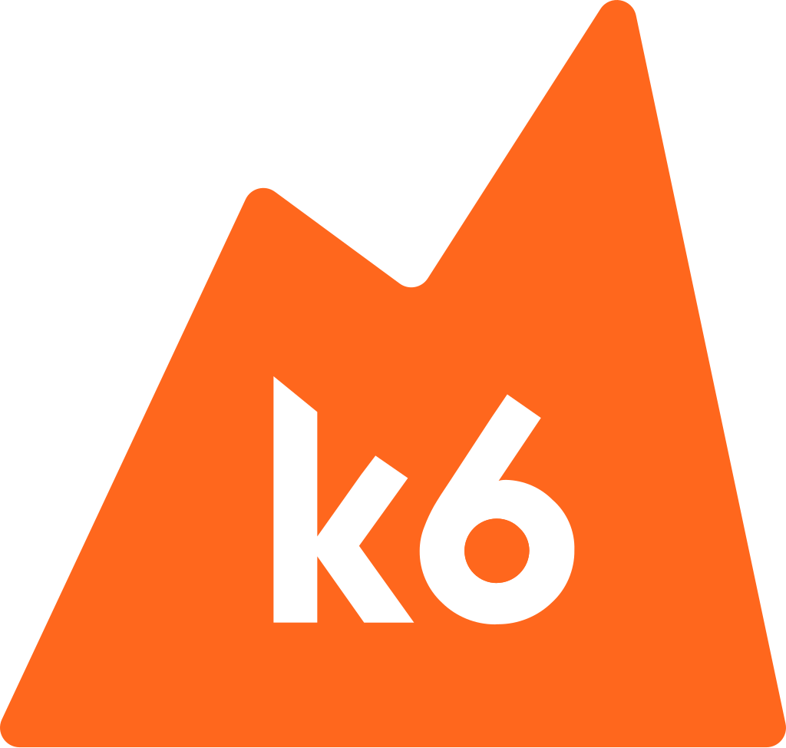

<h3 align="center">Browser automation and end-to-end web testing for k6</h3>

An extension for k6 adding browser-level APIs with rough Playwright compatibility.

  
  
  
   
  
  

    <a href="https://github.com/grafana/k6/releases/latest">Download</a> ·
    <a href="https://grafana.com/docs/k6/latest/javascript-api/k6-experimental/browser/">Documentation</a> ·
    <a href="https://community.grafana.com/c/grafana-k6/k6-browser/79">Community Forum</a>

 

 

**xk6-browser** is a [k6](https://k6.io/) extension that supports browser automation through the [Chrome Devtools Protocol](https://chromedevtools.github.io/devtools-protocol/) (CDP). It adds browser-level APIs to interact with browsers and collect frontend performance metrics as part of your k6 tests.

**As of [k6 version 0.43.0](https://github.com/grafana/k6/releases/tag/v0.43.0), xk6-browser is now bundled in k6 as an experimental module, and usable without a separate binary or compilation step!**

https://user-images.githubusercontent.com/10811379/220158567-cdef7ddc-96c5-41d9-854f-a25c5f67e4b3.mp4

Special acknowledgment to the authors of [Playwright](https://playwright.dev/) and [Puppeteer](https://github.com/puppeteer/puppeteer) for their trailblazing work in this area. This project is heavily influenced and in some regards based on the code of those projects.

## Goals

- Bring browser automation to the k6 testing platform while supporting core k6 features like VU executors, scenarios, metrics, checks, thresholds, logging, DNS remapping, IP blocklists, etc.
- Test stability as the top priority by supporting non-flaky [selectors](https://playwright.dev/docs/api/class-selectors) combined with [auto-waiting](https://playwright.dev/docs/actionability/) for actions just like Playwright.
- Aim for rough API compatibility with [Playwright](https://github.com/microsoft/playwright). The reason for this is two-fold; for one we don't want users to have to learn a completely new API just to use xk6-browser, and secondly, it opens up for using the [Playwright RPC server](https://github.com/mxschmitt/playwright-go) as an optional backend for xk6-browser should we decide to support that in the future.
- Support for Chromium compatible browsers first, and eventually Firefox and WebKit-based browsers.

See our [project roadmap](ROADMAP.md) for more details.

## Get started

- [Getting Started](https://grafana.com/docs/k6/latest/using-k6-browser/)
- [Running xk6-browser](https://grafana.com/docs/k6/latest/using-k6-browser/running-browser-tests/)
- [Browser Metrics](https://grafana.com/docs/k6/latest/using-k6-browser/metrics/)
- [Selecting Elements](https://grafana.com/docs/k6/latest/using-k6-browser/recommended-practices/selecting-elements/)

## Documentation

- [Releases](https://github.com/grafana/xk6-browser/releases)
- [API Documentation](https://grafana.com/docs/k6/latest/javascript-api/k6-experimental/browser/) - This documents how to use our API and its current state with xk6-browser.

## Get help

- If you're having issues installing or running xk6-browser, refer to [TROUBLESHOOTING](/TROUBLESHOOTING.md).
- To get help about usage, report bugs, suggest features, and discuss xk6-browser with other users see [SUPPORT.md](SUPPORT.md).
- Community discussion happens at the [xk6-browser forum](https://community.grafana.com/c/grafana-k6/k6-browser/79).

## Additional resources

To find out more about xk6-browser or browser testing in general, check out the following links.

**Note:** since our API is still transitioning, some of the code snippets from the links below might be inaccurate, though the concepts should still be correct. For the latest, refer to our up-to-date [API documentation](https://k6.io/docs/javascript-api/xk6-browser/api/).

- [Introducing browser automation and end-to-end web testing with k6](https://k6.io/blog/announcing-xk6-browser-testing/) - A blog post from our CEO, Robin Gustafsson, where he introduced xk6-browser.
- [What is Browser Testing](https://youtu.be/ieQwRy9UVo4) - An introductory chat with our DevRel team about what browser testing is and why we need to test with browsers.
- [Getting started with xk6-browser](https://youtu.be/CRSTQ6n05hM) - Office Hours episode where our DevRel team shared insights on how to get started with xk6-browser and the state of browser testing with k6
- [Hybrid Performance Testing with k6](https://www.youtube.com/watch?v=nZlleGaf5Ro) - Office Hours episode where our DevRel team talked about what a hybrid performance testing is and how xk6-browser can help.
