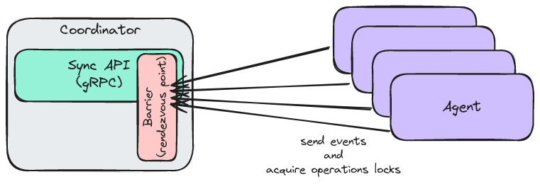
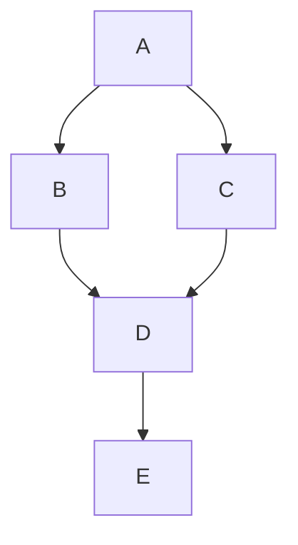

# Distributed Execution

Native distributed execution https://github.com/grafana/k6/issues/140 is simultaneously the oldest and still open k6 issue (opened on Mar 7th 2017, over 6 years ago! :scream:) and [the most upvoted issue ever](https://github.com/grafana/k6/issues?q=is%3Aissue+sort%3Areactions-%2B1-desc), open or closed! It currently has 93 :+1:, which is almost 3 times the upvote count of the next issues after it... And all of that is despite the fact that [Grafana Cloud k6](https://grafana.com/products/cloud/k6/) and [k6-operator](https://github.com/grafana/k6-operator) already allow some kinds of distributed k6 execution!

This document aims to explain some of the historical steps we have made in this direction, some of the context and reasons why it was complicated to implement this before, and a proposal for how we can finally implement it nicely now :tada: :crossed_fingers:

### What is Native distributed execution?

Run a single k6 test-run across several instances and/or machines. Ideally, having the same and consistent user experience that k6 provides running on a single instance. 

### Why?

>There are at least a couple of reasons why you would want to do this:
>
>- You run everything else in Kubernetes, or any other kind of similar infrastructure, and would like k6 to be executed in the same fashion as all your other infrastructure components.
>- You want to run your tests within your private network for security and/or privacy reasons.

https://grafana.com/blog/2022/06/23/running-distributed-load-tests-on-kubernetes

## Context

### Ancient History :t-rex:

At the dawn of time, before [k6 v0.27.0](https://github.com/grafana/k6/releases/tag/v0.27.0) and the infamous [#1007](https://github.com/grafana/k6/pull/1007), test execution in k6 happened somewhat weirdly. Chief among other weird things, there were two distinct test execution paths and that caused a lot of problems.

The first execution path was used for regular `k6 run script.js` local test runs. When using it, k6 basically adjusted the number of currently looping VUs once every millisecond to be whatever they were supposed to be at that moment. In essence, it adjusted the active VU count based on the current test run time and the value of the `stages` option. However, when using the second execution path, the k6 process suspended its own "judgement" and just listened for external instructions via its REST API to "know" how many VUs were supposed to be looping at any given moment.

This second execution path is how distributed cloud execution happened before: a central testcoordinator process calculated how many VUs were supposed to be running on every k6 instance and it sent instructions to all of them once every second to adjust their VUs to the correct number. This architecture caused a bunch of problems (e.g. minor network problems or delays caused serious issues, semi-duplicate code paths caused subtle bugs and slightly different behaviors between local and cloud execution, etc., etc.), but it was a reasonably serviceable solution for the time.

However, it would have been nearly impossible to adapt that architecture to nicely support multiple [scenarios](https://k6.io/docs/using-k6/scenarios/) with different [executors](https://k6.io/docs/using-k6/scenarios/executors/), [arrival-rate executors especially](https://k6.io/docs/using-k6/scenarios/concepts/open-vs-closed/), as well as scenario options like [`gracefulStop` and `gracefulRampDown`](https://k6.io/docs/using-k6/scenarios/concepts/graceful-stop/). Due to issues like the variability and unpredictability of script iteration durations, a central testcoordinator node would not have had enough information to adequately control the various instances without a lot more bi-directional communication between it and the instances. Even if we ignore the hellish complexity of such an approach, this would have greatly exacerbated the already existing architectural problems and introduced a bunch of new ones...

### Origins of the Current State

So, a different solution was needed! :bulb: Instead of having an uber-complicated and all-knowing central testcoordinator node, I chose to go the other way and actually make it "dumber". The way I chose to do that was to make individual k6 instances "smarter" and somewhat aware that they are a part of a distributed test run via [the execution segment and sequence options](https://k6.io/docs/using-k6/k6-options/reference/#execution-segment).

Now, when a test run is partitioned between multiple k6 instances, each k6 instance is started with its own execution segment. If we represent 100% of the test run as the interval between `0` and `1`, an execution segment is a non-overlapping subsection of that interval defined by 2 rational numbers. For example, a test run can be equally split between 4 instances with the execution segments of `0:1/4`, `1/4:1/2`,`1/2:3/4`, and `3/4:1`, each representing 25% of the whole test. If we start each k6 instance with its own execution segment (and, for somewhat complicated reasons, the sequence of all instance segments), it allows it to independently and efficiently execute only its own piece of the test. That is, each k6 instance will only initialize and spin up the VUs it is supposed to and start the iterations it is supposed to, regardless of how many scenarios were configured. _(The algorithms here are interesting and probably deserve their own long post, but they are out of scope for this already quite long document...)_

If the whole interval between `0` and `1` is covered by execution segments, then a distributed k6 test on multiple machines with these segments should behave **exactly** as if a big k6 test was run on a single beefy machine (ignoring any network delays due to geo-distribution, of course). One of the big benefits of this approach is that k6 now uses the exact same code paths for normal local `k6 run script.js` tests and for distributed tests (where we have multiple instances with `k6 run --execution-segment=X:Y --execution-segment-sequence=0,X,Y,Z,...,1`). That is because `k6 run script.js` is actually a shorthand for `k6 run --execution-segment=0:1 script.js`, i.e. the default execution segment value is `0:1`. Or, in human terms, by default k6 just runs the whole test, with the exact same logic and code that is capable of running only a very specific segment of the test. There is _(*mostly :sweat_smile:)_ no second execution path anymore! :tada:

Another big benefit of this architecture is that every k6 instance in a distributed test knows what it's supposed to be doing, without any network communication between it and the other k6 instances. And, _once the test fully starts_, there isn't even a need for communication between it and the central testcoordinator!

### Missing Parts in the Current State

While the current distributed execution solution is much better than before, it's still very, very far from perfect... :disappointed:

One big shortcoming is hidden behind the "_once the test fully starts_" caveat above. While execution segments allow the actual test execution to happen independently on multiple machines so that "the sum of the parts" is equal to the whole test run (as if it was executed on a single machine), they don't do anything for all of the initialization logic and actions that happen before the test run starts and after it ends, or for error handling, or for metric crunching and thresholds.

Let's assume we have somehow fully partitioned a test run into multiple execution segments and we have initialized all of these planned "instances" (e.g. containers, k8s pods, VMs, etc.). Here is a list of (hopefully) all of the tasks that need to be handled so that distributed k6 execution has good UX and works nicely:
1. **Pass the archive**: We _somehow_ need to distribute the script [.tar archive bundle](https://k6.io/docs/misc/archive-command/) among all of the "instances" that will run the test. Ideally without the user having to manually do anything except point the instances to a central node or registry of some sort.
2. **Run setup once**: We _somehow_ need to ensure that [`setup()`](https://k6.io/docs/using-k6/test-lifecycle/) is executed only once (i.e. on a single instance), but that any errors in it are correctly handled, and that its results are distributed to the other instances that didn't execute it.
3. **Ready status**: _Something_ needs to ensure that all instances have finished initializing their VUs before we _somehow_ start the actual test run on all of them simultaneously. This simultaneous start is important because, without it, a distributed test run will behave very differently to the same test run on a single big machine. Everything will be out of whack and k6 will behave unpredictably, which is something we don't want in a tool that is used to measure other services. Predictable performance is key when you are the measuring stick!
4. **Failure detection**: While the test execution will be autonomously handled by each k6 instance for its own execution segment, _something_ needs to handle failures in a user-friendly way. For example, some of the k6 instances might suffer network problems or might die due to a bad test script or out-of-memory issues, so we somehow need to detect such problems and potentially stop the whole test.
5. **Metric aggregation**: While the test is executing, we _somehow_ need to collect all of the metrics from all instances and crunch them, because we need the aggregated metrics to produce the [end-of-test summary](https://k6.io/docs/results-output/end-of-test/) and to calculate whether the [script thresholds](https://k6.io/docs/using-k6/thresholds/) were crossed. For these calculations to be correct, we can't do them separately on every k6 instance in a distributed test, we need to first aggregate the results centrally and use that for the calculations. This is particularly important because some thresholds might be [configured with `abortOnFail`](https://k6.io/docs/using-k6/thresholds/#abort), which means that we need to be continuously crunching the data, since they can require us to stop the test run mid-test!
6. **Abort the test-run**: Besides thresholds with `abortOnFail` and errors, there are also a lot of other ways to prematurely stop a k6 test run, e.g. by calling [`test.abort()` from `k6/execution`](https://k6.io/docs/javascript-api/k6-execution/#test) or simply hitting Ctrl+C. _Something_ needs to handle such cases nicely. See https://github.com/grafana/k6/issues/2804 for more details, but ideally we should have the same nice UX in distributed k6 test that we have in regular local k6 tests, including the same exit codes that can be checked in a CI system.
7. **Done status**: Even if the test hasn't finished prematurely, _something_ needs to detect that all instances are done with their part of the test run. Because of executors like [`shared-iterations`](https://k6.io/docs/using-k6/scenarios/executors/shared-iterations/) and [`per-vu-iterations`](https://k6.io/docs/using-k6/scenarios/executors/per-vu-iterations/) and because iteration durations vary, only the maximum test duration is predictable and bounded, but the test might finish a lot sooner than that max possible duration and good UX would be to not force the user to wait needlessly.
8. **Run teardown once**: Regardless of whether the test has finished nominally or prematurely, _something_ needs to detect that it _has_ finished and must run `teardown()` on only one of the available instances, even if there were errors during the test. This is important because `setup()` might have potentially allocated costly resources. That said, any errors during `teardown()` execution must also be handled nicely.
9. **End-of-test and handleSummary**: After `teardown()` has been executed, we _somehow_ need to produce the [end-of-test summary](https://k6.io/docs/results-output/end-of-test/) by executing the [`handleSummary()` function](https://k6.io/docs/results-output/end-of-test/custom-summary/) on a k6 instance _somewhere_. For the best UX, the differences between local and distributed k6 runs should be as minimal as possible, so the user should be able to see the end-of-test summary in their terminal or CI system, regardless of whether the k6 test was local or distributed.

So, yeah, while execution segments handle most of the heavy lifting during the test execution, there are plenty of other peripheral things that need to be handled separately in order to have fully-featured distributed k6 execution... :sweat_smile:

### Problems of the Current State

At the moment, to reduce the already huge scope of https://github.com/grafana/k6/pull/1007, most of these jobs are handled by a remnant of the old pre-#1007 k6 cloud distributed architecture. There is still a central testcoordinator, albeit a somewhat dumber one, which works together with a thin wrapper around k6 to handle tasks 1, 2, 3, 4, 7 and 8 (and a few other cloud-specific things). Metric crunching (tasks 5 and 6) is handled by every k6 instance streaming its results to the k6 cloud backend (basically `k6 run --out cloud`). However, even so, `handleSummary()` (task 9) is still unsupported in `k6 cloud` (https://github.com/grafana/k6-cloud-feature-requests/issues/24) and remains a heavily requested feature.

The lack of support for `handleSummary()` in `k6 cloud` is only one of several major reasons why we can't just open-source some of our current cloud components and consider "native distributed execution" in k6 to be done :sweat_smile: Besides a host of other implementation details that closely tie the current solution to specifics in our cloud service and prevent us from directly open-sourcing it, the current cloud solution has at least 2 major architectural problems.

First, now is the time to qualify what I meant by "_mostly_" in the "There is _(*mostly :sweat_smile:)_ no second execution path anymore!" sentence above. While there is no second _test_ execution path anymore, because of the execution segments, everything at the periphery I described in the points above kind of needs at least two separate implementations... :disappointed:

k6 handles all of these operations perfectly well on its own, when it is run locally in a single `k6 run` instance. It knows how to run `setup()` and `teardown()` and `handleSummary()`, how to handle errors and correctly stop the test prematurely, how to crunch metrics and thresholds, etc. However, as soon as we run multiples k6 instances (either from k6 cloud or [k6-operator](https://github.com/grafana/k6-operator) or manually), we actually need to disable that built-in k6 logic (e.g. with `--no-setup`, `--no-teardown`, `--no-summary`, etc.) and re-implement some of it externally. So we end up with two (or more!) re-implementations of some of the same things. That costs a ton of effort, is unevenly implemented (e.g. https://github.com/grafana/k6-operator/issues/223) and even when it's implemented, there are often subtle differences in behavior between the implementations that might surprise users unpleasantly!

Secondly, a big architectural problem of the current distributed execution solutions is that they have a push-based and top-down control mechanism. _Something_ centrally needs to "see" all k6 instances, so it can connect to them and send them commands. Besides the logistical problem of having one node connect to many, there is also no way for these k6 instances to synchronize some more subtle things between themselves.

This limited control mechanism is what's actually causing the need to re-implement some of the current k6 logic externally (e.g. top-down instance synchronization, `setup()` and `teardown()` handling, etc.). And it's also preventing us from implementing a lot of very heavily requested features like test suites (i.e. executing multiple scripts with a single k6 run, see https://github.com/grafana/k6/issues/1342), `SharedArray` improvements (https://github.com/grafana/k6/issues/2043 / https://github.com/grafana/k6/issues/2962), https://github.com/grafana/k6/issues/1638, etc.

## Proposed Solution

So, ideally, instead of figuring out how to open the limited cloud solution we currently have, we should probably create a new and better distributed execution solution that is suitable for both k6 cloud and k6 open-source users (both via [k6-operator](https://github.com/grafana/k6-operator) or otherwise).

### Goals

Let's start with the goals first:
1. Ideally, implement all 9 points from the list :arrow_up:, as well as anything else required, to get native distributed execution with great UX in k6 :sweat_smile:
2. Have a distributed execution solution that works well for all k6 open-source users, regardless of whether they want to use it directly or via something like k6-operator. At the same time, k6-operator and k6 cloud both should also be able to make use of some of the new features and become even better than they currently are!
3. As much as practically possible, do it in a backwards compatible manner. Some changes in k6 cloud and k6-operator are expected and even wanted, but if we keep `k6 run` backwards compatible, these changes don't _need_ to happen immediately, they can be incremental and non-breaking improvements over time.
4. As much as practically possible, have only one way to do a certain thing. We want to avoid re-implementing the same logic in multiple places whenever possible.

### Architecture

The good news is that all of these goals seem achievable :tada: Or at least this is my opinion after making the proof-of-concept implementation (https://github.com/grafana/k6/pull/2816).

#### Reverse the pattern

My proposal is to basically continue what [#1007](https://github.com/grafana/k6/pull/1007) started... :sweat_smile: That is, continue moving more and more of the logic out of the center and towards the edge, towards the individual k6 "worker" instances that actually execute the distributed test run. For the best UX we should probably still have some sort of a central coordinator node, but if we reverse the control flow, so that k6 "worker" instances connect to it and are the main actors instead of the central node, then the central coordinator node can be relatively "dumb".

After all, a single k6 instance is already perfectly capable of executing all the steps in a local `k6 run script.js` test run, from start to finish, completely on its own! And while every single k6 instance in a distributed test run is aware of its own execution segment, it is also already _somewhat_ aware of the existence of the other instances in the test run, from the execution segment sequence. It may not know their IPs or any other details, but it already knows that they exist and even their total number and segments!



#### Instance Synchronization API

Let's suppose for a moment that k6 instances in a distributed test run have _some way_ to communicate indirectly, _some central service or registry_ they can all connect to and use in _some manner_ (I'll get back to that later). What types of synchronization and communication operations would be sufficient for a bunch of k6 instances that already know how to execute tests to self-organize and run a distributed test cooperatively?

My suggestion is that we can call this API `execution.Controller`, and that we might need only a few very simple operations in it. For example:
```go
type Controller interface {
    // GetOrCreateData requests the data chunk with the given ID, if it already
    // exists. If it doesn't (i.e. this was the first time this function was
    // called with that ID), the given callback is called and its result and
    // error are saved for the ID and returned for all other calls with it.
    //
    // This is an atomic function, so any calls to it while the callback is
    // being executed the same ID will wait for the first call to finish
    // and receive its result.
    GetOrCreateData(id string, callback func() ([]byte, error)) ([]byte, error)

    // SignalAndWait implements a rendezvous point / barrier, a way for all
    // instances to reach the same execution point and wait for each other, before
    // they all ~simultaneously continue with the execution.
    //
    // It subscribes for the given event ID, signals that the current instance has
    // reached it without an error, and then waits until all other instances have
    // reached it or until there is an error in one of them.
    SignalAndWait(eventID string, err error) error
}
```

The idea behind this API is that, for local single-instance execution (i.e. for `k6 run script.js`), these functions would basically be no-ops and nothing will change when they are called. Because we have only a single instance, `Controller.GetOrCreateData()` will immediately call the `callback` and `Controller.SignalAndWait()` will immediately reach the required number of 1 total instances, so it will not need to actually block and wait for anything. In essence, adding these calls to the test execution code of k6 will not affect local `k6 run` tests in any way, that will continue working exactly as it currently works... :tada:

However, when multiple k6 instances are simultaneously running the same test run, we can inject a different distributed implementation of the `execution.Controller` API! Then all of the instances can use this API (e.g. as implemented by some central place they can all access, a "coordinator" node) to cooperatively synchronize with each other! For example:
- Instead of that central coordinator querying and waiting for all instance to initialize their VUs, so it can synchronize their test start, the instances themselves can all call `SignalAndWait("test-ready-to-run-setup")` when they have initialized their allotted VUs and are ready to run `setup()` :tada:
- After that, instead of that central coordinator node managing `setup()` execution manually and duplicating already existing k6 code, all of the k6 instances can just call `GetOrCreateData("setup", func() ([]byte, error) { /* actual code that runs setup */ })`. Because of the synchronization promises of the API, the `actual code that runs setup` is guaranteed to be executed only once, on a single instance, while all other instances wait for it to be done and get its result! :sparkles:
- After that, all instances can synchronize again with `SignalAndWait("setup-done")`, to ensure that all of them have received and saved the `setup()` result, so that they simultaneously start the actual test execution, all at the same time.

That's basically it... :sweat_smile: As I said, every k6 instance already knows how to run tests from start to finish. In a distributed test run, it just needs a bit of help to synchronize itself and cooperate with the other instances! Because most of the heavy lifting is done by the execution segments, the rest of the synchronization can be done with a very simple and lightweight API! :tada:

##### Instance Synchronization API Details

The above API proposal was mostly for illustrative purposes, since it maps very directly to the current k6 operations that need to be synchronized in a distributed k6 test run.

While it would be sufficient to get the job done, it might be better to split these multi-action methods into their simpler constituent synchronization primitives. For practical implementation purposes that will make everything easier and the complex logic can be moved to helpers that use the simpler primitives the `Controller` API would provide. That way both the usage and the implementation of these APIs would be easier to write, especially when it comes to error-handling. It will also allow us to reuse some of the same APIs for test suites!

For example, the `SignalAndWait()` API call can be made into a helper function if the API had separate `Signal(eventID, error)` and `Subscribe(eventID)` simpler methods that it can use. See how something like this [could look like in the `proofs-of-concept` branch of the k6 repo](https://github.com/grafana/k6/blob/proofs-of-concept/execution/controller.go). The `GetOrCreateData(id, callback)` can also be refactored into separate `Once(callback)`, `SetData(id)` and `GetData(id)` calls, though that would mean that the `local` implementation of the `execution.Controller` will need to actually do a tiny amount of work :sweat_smile:

In any case, the exact `execution.Controller` API is not even all that important. There are multiple ways it can be done, including on top of some non-k6 services like etcd (_see the "Alternative Solutions" section below_). The important bit is that all we need to get distributed execution is a relatively simple API that can have 2 implementations: a (mostly) no-op one for local `k6 run` tests and a somewhat more complex (but still quite lightweight) API for distributed tests! :tada:

#### User-facing Commands

Let me get back to the actual user-facing functionality. My proposal is to introduce 2 new k6 sub-commands, e.g. let's call them `k6 coordinator` and `k6 agent` for now _(though if anyone has better name suggestions, please share!)_. Each of these new sub-commands will do a part of the work that `k6 run` currently does, by reusing the same underlying functions and code, so no actual code duplication! And when you combine a single instance running `k6 coordinator` and an arbitrary number of instances that are running `k6 agent`, you get distributed execution :tada: :sparkles:

`k6 coordinator` details:
- it expects the JS script file as its argument (e.g. `k6 coordinator script.js`) and is responsible for a packaging the JS file and its dependencies in a .tar archive bundle (i.e. basically what `k6 archive` and `k6 cloud` already do)
- it can receive the same CLI flags that `k6 run`, `k6 archive` and `k6 cloud` can, e.g. you can have `k6 coordinator --vus 5 --duration 10m script.js`
- it can also accept information for how many `k6 agent` instances to expect; in the [PoC PR](https://github.com/grafana/k6/pull/2816) I did this with a simple `--instance-count` integer CLI flag, but in the real implementation we'd probably want to be able to specify the full `ExecutionSegmentSequence` and maybe even some tag-based rules (e.g. segment N should go to instance with tags `{foo: bar, baz: 123}` or something like that) :thinking: or more than one set of `ExecutionSegmentSequence`+tag-based rules, considering that different tests in a test suite (see below) can have different distributions between instances... :thinking:
- after it has parsed the options and packaged the archive bundle, it starts up a gRPC server on a configurable address and waits for connections from `k6 agent` instances
- in the PoC I haven't added any authentication, but given that this will be a server that's potentially exposed over the internet, some token and/or TLS-based auth of the gRPC connection by agents is probably a good idea
- when a `k6 agent` instance has successfully connected to the `k6 coordinator` gRPC server, the server sends it the packaged `.tar` archive bundle as well as the unique options for that instance (e.g. its execution segment)
- the `k6 coordinator` gRPC server also provides the simple `execution.Controller` synchronization API that I described above, so that `k6 agent` instances can use it to themselves; it is also responsible for some of the error handling (e.g. when an instance dies or gets disconnected)
- finally, it can accept metric snapshots (more on this below) from `k6 agent` instances and is responsible for crunching the thresholds during the test run and for calling `handleSummary()` at the end of the test run

`k6 agent` details:
- it expects the address of the gRPC server as its only argument and doesn't support any CLI flags except the ones that are needed for that connection (e.g. for gRPC authentication, instance tags it can identify itself with to get its own segment, etc.), so something like this `k6 agent <k6-coordinator-addr:port> --auth <whatever> --instance-tag foo=bar --instance-tag baz=123`
- once it has connected to the `k6 coordinator` server, it receives the .tar archive bundle from it (in the current PoC that is pushed by the server on connection, but a better architecture might be pull-based one on top of `Controller.GetData()` :thinking:)
- after that, `k6 agent` behaves identically to `k6 run` (even reusing the same code), with two major differences:
  1. instead of a the no-op local execution `execution.Controller` that `k6 run` uses, `k6 agent` uses a real distributed execution implementation of the `execution.Controller` synchronization API, built on top of the `k6 coordinator` gRPC service
  2. instead of crunching the metrics locally for the end-of-test summary and thresholds, `k6 agent` streams them periodically to the `k6 coordinator` service

And that's basically it :tada:

#### Metrics Handling

The only missing piece is efficiently streaming the metrics from agents to the coordinator. And one big prerequisite for that was already merged in k6 v0.43.0! A series of refactoring efforts spanning many PRs and culminating in https://github.com/grafana/k6/pull/2815 removed the problematic `core.Engine` component! It had a bunch of problems, but the biggest issue was that it was simultaneously responsible for two very different jobs: managing the test execution and crunching metrics. While `k6 run` still continues to do both of them even now, we needed to be able to split them in different and simpler components so that `k6 agent` does only the test execution orchestration (i.e. the 9 tasks above and the actual test execution) while `k6 coordinator` does only the metrics crunching!

One remaining prerequisite is efficient metric transmission over the network and efficient metric processing by the coordinator node. That can be easily implemented for `Counter`, `Gauge`, and `Rate` metrics because all of their raw `Sample` values are easily aggregated without a data loss (at least when it concerns the end-of-test summary and the current k6 thresholds), and aggregations of their aggregations will also be correct (we are basically just summing numbers or comparing times :sweat_smile:). However, for `Trend` values, we probably should implement HDR/sparse histograms (https://github.com/grafana/k6/issues/763) before we have distributed execution. Not just because of the more efficient network transmission, but mostly because we don't want to overwhelm the `k6 coordinator` node or have it run out of memory (`Trend` metric sinks currently keep all of the raw observation values in memory...).

As these days, most of the observability world is using OpenTelemetry protocol for emitting metrics, we may benefit from it as well. The coordinator node should expose an OpenTelemetry endpoint for ingesting metrics, with the following advantages:
- It supports an efficient binary format over gRPC
- It supports delta temporality as k6
- It supports histogram aggregation
- An OpenTelemetry metrics output is something we want to add independently from the distributed execution feature

In any case, when performance matters or a high cardinality of metrics is generated then we should encourage people to use a proper storage systems for metrics, via outputs. As k6 is not a metrics database, it is expected to be good enough at store a non-intensive metrics generation but in case of high volume then it may be better if we use the right tool for the job.
Otherwise, as explained below, the coordinator could be flooded and become unstable, potentially we may mitigate the issue in case of spikes having classic back pressure and retry mechanisms.

#### Test abortion

A test can be aborted in several ways, as described in [this summary issue](https://github.com/grafana/k6/issues/2804). For example, in the event the running script invokes the `test.abort()` function, below the expected flow:

1. The agent will intercept the abortion as done by a non-distributed run, and it emits an event for aborting the distributed test
2. Then the agent will continue the abort flow for the single instance that will lead to stop the test on the instance and exit
3. TC reacts to the received event broadcasting it to all instances, as they should have a dedicated routine listening for any abortion event
4. All the instances executes the abortion flow as the point `3`, returning the same error received from the event.

Instead, if the abortion process is started by the Coordinator, for example, if it has received a SIGTERM signal, the following is the expected flow:
1. Declare the test abort emitting a dedicated event for it
2. Close the connections with instances using the gRPC GOAWAY flow
3. Each Agent instances listening for abortion event will process it stopping the run and exiting

#### High Availability

As you might have noticed, the central `k6 coordinator` node is a single point of failure in the proposed architecture. Because of its simple API, it can actually be made highly-available fairly easily (or maybe even replaced with already fault-tolerant/HA components), but I'd argue it is not worth it to spend the time on that, at least in the first version.

Given the fact that k6 is used as a measuring stick for other systems, it needs to perform well. But even more importantly, it needs to have a consistent and predictable performance! Our users rely on k6 to spot performance changes in their own services, so two runs of the same script with the same k6 version on the same hardware and with the same execution type (local or distributed) should perform as identically as possible. It'd be difficult to measure things if your ruler changed sizes before every measurement... :sweat_smile:

That's why I think it'd be better for a test to completely fail than for us to have k6 performance be variable between different runs of the same test. So, generally, if one of the "worker" instances fails for some reason (e.g. OOM, script errors, network problems), the whole test should probably fail. The only (arguable) exception is huge tests that with a lot of instances and provisioned resources, where it might be better to allow a very small percentage of the total number of instances (e.g. 1%, 5%) to fail before we scrap the whole test and waste all of the allocated resources. But it's important to acknowledge that test failure is not the worst option around, we don't need to (and we actually can't) ensure 100% reliability of every single k6 test, be it local or distributed.

Because of the potential complexity of k6 scripts (especially ones with multiple scanarios), and because of the stateful nature of k6 VUs, we actually can't just replace failed instances with "hot spare" ones mid-test, even if we ignore problems with performance consistency. Something like this might only be possible with test suites (see bottom of this document), but not within an individual k6 test.

In summary, if we make the `k6 coordinator` node dumb enough and the metric transmission efficient enough, it'd be much more likely for a test to fail because of a bad script that eats up all of the RAM, or because of network issues, or due to all sorts of other potential problems on the `agent` side... So, a non-highly-available `k6 coordinator` is probably good enough, at least to start with.

#### Disruption resilience

Based on the high availability assumption described, the architecture is intentionally not very highly resilient to disruption. Below, the process described for the components in the event of disruption.

##### Coordinator

For its nature of being a single point of failure, the `Coordinator` results to be the most impactful part of the architecture in case of disruption.

In the event, Testcoordinator disappear the agent instances will not be able to complete the test as they will remain in a stuck status waiting for the connection to return reliable, after the gRPC connection's defined timeout expires, each agent instance will abort the ongoing test run and will shut down.

In the event, a graceful shutdown (SIGTERM signal received) is initiated by Testcoordinator then it is expected to execute the flow described in test abortion section.

##### Agent

Eventually, Agent instances could be more resilient.

If an instance at some point disappear, the system should tolerate this failure in some percentage requested by the user or by the default value. It means that a rendezvous point on the Sync API will have a timeout and if all the instances haven't reached the same point in a specified time frame then the Testcoordinator will remove those instances from the number of required instances for the sync consensus. 

However, in a first experimental version, is not expected to implement and support this described scenario. The flow will let the instances stuck on the rendezvous point that at some point will make the request timing out and the Agent instance will start the abortion flow.

### An end-to-end example

It shows the end-to-end flow for the simplest use-case in a distributed test-run.
The first step requires to startup the `cordinator`:
```sh
k6 coordinator script.js
```

that starts the gRPC server for synchronization API:
```sh
k6 coordinator --instance-count 2 script.js
INFO[0000] Starting gRPC server on localhost:6566
```

At this point, the coordinator listens for a number of connected agent instances equals to the value defined. For this reason, at this point, we need to startup the agent instances:
```
k6 agent localhost:6566
```
and again in a different terminal session:
```
k6 agent localhost:6566
```

At this point the coordinator reached the expected status and it will notify the agent instances to start the test-run. When the agents will have been finished the coordinator will close the gathering process for metrics and it will publish the summary.
```
k6 coordinator --instance-count 2 script.js
INFO[0000] Starting gRPC server on localhost:6566
INFO[0005] Instance 1 of 2 connected!
INFO[0017] Instance 2 of 2 connected!
INFO[0018] All instances ready!
INFO[0018] Test 1 (script.js) started...
INFO[0049] Test 1 (script.js) ended!
INFO[0049] Instances finished with the test suite
INFO[0049] Instance 1 disconnected
INFO[0049] Instance 2 disconnected
INFO[0049] All done!

     data_received..................: 3.1 MB 99 kB/s
     data_sent......................: 19 kB  597 B/s
     http_req_blocked...............: avg=18.43ms  min=4.09µs med=8.67µs   max=290ms p(90)=12.4µs   p(95)=249.54ms
     http_req_connecting............: avg=8.33ms   min=0s     med=0s       max=130ms p(90)=0s       p(95)=114.66ms
     http_req_duration..............: avg=129.33ms min=110ms  med=123.2ms  max=260ms p(90)=135.66ms p(95)=227.74ms
       { expected_response:true }...: avg=129.33ms min=110ms  med=123.2ms  max=260ms p(90)=135.66ms p(95)=227.74ms
     http_req_failed................: 0.00%  ✓ 0        ✗ 270
     http_req_receiving.............: avg=7.17ms   min=63µs   med=140.57µs max=130ms p(90)=209.36µs p(95)=111.86ms
     http_req_sending...............: avg=36.95µs  min=12µs   med=36.13µs  max=84µs  p(90)=50.1µs   p(95)=66.54µs
     http_req_tls_handshaking.......: avg=8.61ms   min=0s     med=0s       max=140ms p(90)=0s       p(95)=117.16ms
     http_req_waiting...............: avg=122.13ms min=110ms  med=122.44ms max=150ms p(90)=129.48ms p(95)=133.08ms
     http_reqs......................: 270    8.516465/s
     iteration_duration.............: avg=1.17s    min=1.1s   med=1.15s    max=1.5s  p(90)=1.25s    p(95)=1.35s
     iterations.....................: 267    8.421837/s
     vus............................: 5      min=5      max=5
     vus_max........................: 5      min=5      max=5
```

### Alternative Solutions

One proposal in the original posts of https://github.com/grafana/k6/issues/140 was to build the distributed execution on top of something like [etcd](https://github.com/etcd-io/etcd) (or Consul, Redis, etc.) and a central metrics storage like InfluxDB (or, more likely nowadays, Prometheus/Mimir :sweat_smile:)

While there were some details in the original proposal that are no longer applicable because of the big architectural changes in k6 in the meantime, the overall proposal is probably still valid. I am pretty sure that the architecture I proposed above can be built on top of these technologies and in a way where instances don't need to hold a persistent connection to a central `k6 coordinator` node!

However, I think that the benefits of such an approach would be outweighed by the drawbacks in terms of implementation and deployment complexity. In short, it can probably work, but IMO the UX will be worse. Even if we ignore the complications of deploying multiple software stacks (vs. just the k6 binary), it'd be difficult to implement great error handling and timely handling of things like `abortOnFail` thresholds and `test.abort()` API calls. It can certainly be done, but it'd be a ton of effort to not get a flaky experience...

And, as I explained in the "High Availability" section above, a k6 test failing is not the worst thing that can happen. An inconsistent or a flaky test is a worse user experience in my mind.

### Review of "Missing Parts in the Current State"

Let's get back to my actual proposal of a `execution.Controller` API + new `k6 coordinator` and `k6 agent` sub-commands.

To show that the proposed solution is a viable one, I'll go through the 9 items from the list in the "Missing Parts in the Current State" section and show how the proposal can be used to easily implement them:
1. `k6 coordinator` assembles the script and its dependencies into a [.tar archive bundle](https://k6.io/docs/misc/archive-command/) and distributes it to all `k6 agent` nodes automatically once they connect to it (either pull-based or push-based).
2. I showed how `setup()` can be cooperatively execuded only on a single instance and how its result can be distributed to the rest of the instances with the `GetOrCreateData()` pseudo-API described in the "Instance Synchronization API" section.
3. Similarly, in the "Instance Synchronization API" section I showed how the `SignalAndWait()` pseudo-API can be used to ensure that all instances have finished initializing their VUs and executed `setup()` before they start the actual test execution simultaneously
4. Most failures will be handled by the coordinator and propaged to waiting instances. For the best UX, instances might subscribe to a special error channel so they can be interupted even during the test execution.
5. Metric collection was described in the "Metrics Handling" section, and the coordinator will be able to stop the test if a threshold is crossed.
6. We can probably handle `test.abort()` calls from an instance with a `GetOrCreateData()` call that uses a special `dataID` watched by the coordinator, but it might be simpler to just add a custom API for that... :thinking:
7. Detecting when the test has finished is trivial with `SignalAndWait()`.
8. `teardown()` can also be executed the same way we do `setup()`. Though, because it doesn't return any data, it is one of the reasons I think it makes sense to split `GetOrCreateData(id, callback)` into separate `Once(callback)`, `SetData(id)` amd `GetData(id)` calls...
9. The `k6 coordinator` node can run `handleSummary()` after the test is done, no problems there :tada:

### Additional Benefits

Because `setup()` will no longer be special and because we'll have a generic mechanism for an instance to generate some data and make it available to all other instances, there is nothing stopping us from implementing support for `SharedArray` (and other similar constructs) outside of the init context (https://github.com/grafana/k6/issues/2043 / https://github.com/grafana/k6/issues/2962) :tada: Or even things like per-scenario `setup()` (https://github.com/grafana/k6/issues/1638) or per-VU init functions (https://github.com/grafana/k6/issues/785) can now be actually useful.

And maybe even more importantly, because k6 instances will now basically self-synchronize, test suites (https://github.com/grafana/k6/issues/1342) become much, much easier to implement :tada: See below for details, but we basically no longer need to have a super-smart coordinator node that knows the details for how tests are a part of the test suite, only k6 itself needs to know that and use the same `SignalAndWait()` API to synchronize even multiple tests simultaneously :tada:

A potential improvement for getting a simplified user experience, when the API will be defined as stable, could be to hide the coordinator interface just behind the classic `k6 run` command. When a dedicated flag like `k6 run --distributed` is passed then the command will act as a coordinator. In this way, we are not forcing to the users the requirement to know what a _coordinator_ is. Only users with advanced cases will may require to know it and its dedicated command. 

# Test suites

https://github.com/grafana/k6/issues/1342 is far behind https://github.com/grafana/k6/issues/140 when it comes to upvotes, but it is still one of our most requested features after it.

## Limitations of `scenarios`

In theory, `scenarios` were supposed to solve some of the issues that we are currently hoping that test suites will solve, but in practice they have quite a few limitations:
- No "start after" logic or chaining of scenarios, only limited `startTime` capabilities.
- No CI-like capabilities (e.g. run `B` only if `A` succeeds, run `A` and `B` in parallel and run `C` only of both succeed, etc.).
- VUs in all scenarios have the same global options.
- It's difficult to execute only a subset of all `scenarios` (https://github.com/grafana/k6/issues/2780)
- It's difficult to combine scenarios from different files.
- There is no way to have `setup()` or `teardown()` per scenario (https://github.com/grafana/k6/issues/1638)
- Users cannot share data between scenarios
- Users cannot mix local and cloud scenarios (https://github.com/grafana/k6-cloud-feature-requests/issues/19)
- Users cannot have different geo-distribution between scenarios (https://github.com/grafana/k6-cloud-feature-requests/issues/20)
- VUs are reused between scenarios, which adds complexity when managing state.

In hindsight, while the current `scenarios` have their uses and benefits (especially when it comes to efficiency and support for different executors), they were not the greatest abstraction when it comes to actually partitioning work. https://github.com/grafana/k6/pull/1007 might have been better off had I ignored them or focused on something like the current idea of test suites instead... Though, given how long it has taken us to even reach the point where implementing test suites is feasible, maybe not... :sweat_smile:

In any case, both can exist together and have their valid and complimentary uses, so let's explore how we can implement test suites, even in distributed test runs that follow the architecture from the start of this document!

## Proposed Solution

### Test Execution Control

Once we have the `execution.Controller` API from the "Instance Synchronization API" section above, implementing test suites becomes almost trivial. Though, for this, we will actually to split the composite functions into their constituent parts (e.g. split `SignalAndWait()` into separate `Signal(eventID)` and `Wait(eventID)`), and the local execution implementation of the `execution.Controller` API might need to not be a no-op placeholder anymore and actually do some work... :sweat_smile:

First, let's imagine a somewhat complicated test suite, where you have the following fan-in and fan-out behaviors:


That is, tests `B` and `C` are executed simultaneously, but only after test `A` has finished executing, then test `D` should start running only after both `B` and `C` have finished, and test `E` should start running after `D`. This can become even more complex if we start introducing conditional dependencies, e.g. "if `C` succeeds run `D` otherwise run `E`, but let's consider that out-of-scope, for now :sweat_smile:

First, how can we run this at all? One way is to just use the unique test names as a prefix to the `eventID` and `dataID` identifiers in the `execution.Controller` API :tada: This allows us to keep the API simple but usable for arbitrarily complex test suites.

And we can also reuse the deconstructed `execution.Controller` API to model these dependencies between tests in the suite. In the above example, before test `B` and test `C` can start initializing their VUs, they can just call `Controller.Wait("test-A/test-finished")` (or whatever the actual convention is). Similarly, before test `D` can start, it can call `Controller.Wait("test-B/test-finished"); Controller.Wait("test-C/test-finished")`. And all of this would work in both local and distributed execution! :tada:

Similarly, if we split `GetOrCreateData(id, callback)` into separate `Once(id, callback)`, `SetData(id)` and `GetData(id)` functions, tests down the chain would be able to even reference data from other tests in the suite before them. For example, if we save the result of `handleSummary()` under a `test-X/summary-result` identifier, then, if we want to, other tests would be able to retrieve that data with a simple JS API directly in the test script! And again, all of this would work even in distributed execution, since it relies on the same primitives it does! :tada:

### Bundling Multiple Tests Together

One unknown here is how to bundle multiple independent tests in a single suite, especially if we want to have complex (but still acyclic!) `startAfter` relationships between tests in the suite.

In my PoC I didn't have a ton of time to make a complex solution, so I just added support for a list of tests. `k6 coordinator` basically transmitted them in a slice... :sweat_smile: But we probably want some sort of a more complicated and flexible configuration. My thoughts are that we can have a custom exported variable (e.g. `export const tests`) which k6 knows to interpret as a test suite when it encounters it.

Ideally, we also want to be able to configure custom script entry points and custom environment variables, global script `options`, etc. for every test in the suite, without actually `import`-ing the scripts themselves. This offers the maximum amount of flexibility, see https://github.com/grafana/k6/issues/2919#issuecomment-1437254679 for details.

Additionally, we probably want to support custom thresholds and end-of-test summaries (or disabling them!) both for individual tests in the suite, as well as for the whole test suite together.

Finally, how and if all of these things are packaged in a single (or more than one) .tar (or other) archive bundle is still an open question... :sweat_smile: There are other potential complications here as well, e.g. https://github.com/grafana/k6/issues/2974.
