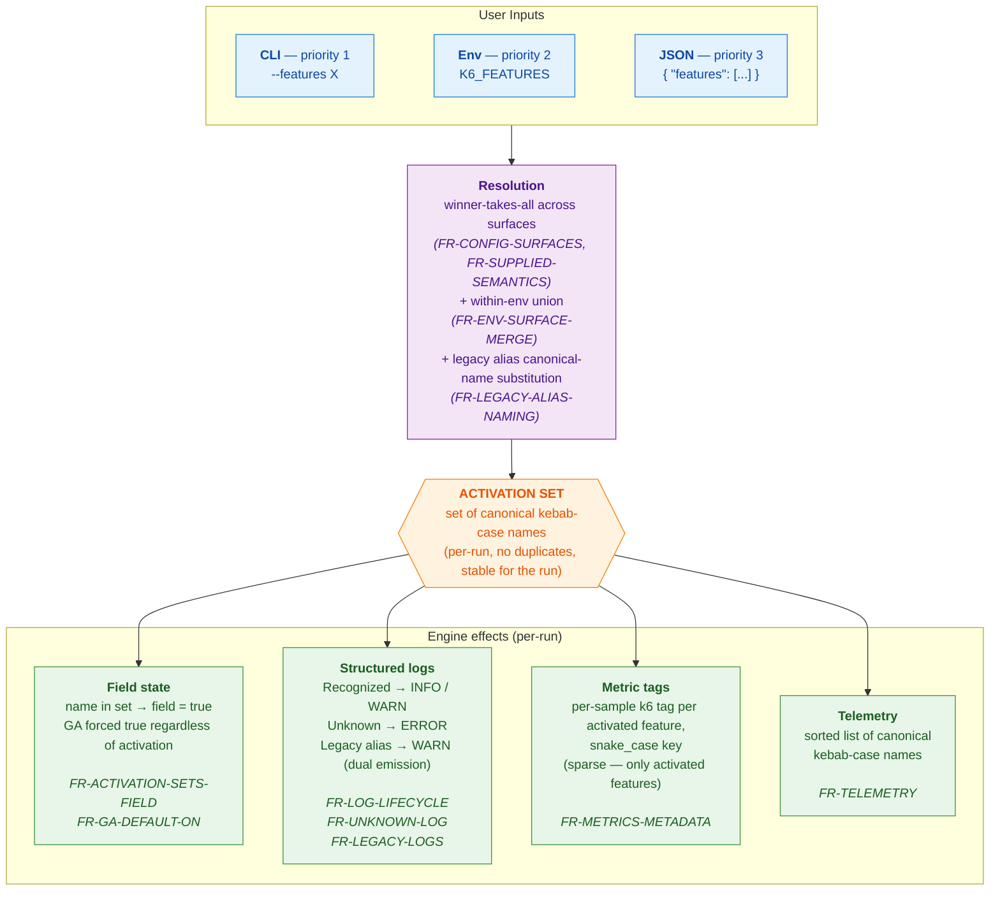

# SPEC: k6 Feature Flags

**Status:** Active
**Epic:** k6 Feature Flags
**Source:** [k6 Feature Flags — Product DNA & Design Doc](https://docs.google.com/document/d/1nlQyS_m26J6gJ0FfZ4jYfOmr6n4dzXtwiC94B3IhxAw) (internal Google Doc, stakeholder-approved). Spec formalize agreed contents.

---

## 1. Overview

k6 now expose experimental/transitional engine capabilities via disconnected ad-hoc env vars (e.g. `K6_FOO_ENABLED`, `K6_BAR_ENABLED`) and nested config fields. No central registry, no shared lifecycle, no discovery. Users can't find what experiments exist or when retired; maintainers accumulate "flag rot" — obsolete toggles linger because nothing force cleanup.

Spec define **k6 Feature Flags**: single standardized system in k6 core engine governing how internal capabilities named, configured, logged, observed, retired. Unified config interface (CLI + env + JSON) under strict `kebab-case` convention, discoverable `k6 features` command, per-stage runtime feedback, near-zero hot-path overhead, observability/telemetry surfacing, structured legacy-variable migration, and forcing function that retire flags as advance through lifecycle — registry stay clean.

### System Diagram

End-to-end flow from user input to engine effects:



See [Glossary](#glossary) at end for one-line definitions of core terms in diagram and FRs.

---

## 2. User Scenarios & Testing

### 2.1 Primary User Story — Enabling a feature for one run

> *Eve, reliability test engineer, want try `native-histograms` for single run without changing CI scripts.*

1. Eve run `k6 run --features native-histograms script.js`.
2. Engine emit `INFO` log: `feature "native-histograms" is experimental and may be changed or removed without notice`.
3. Test run with feature active.
4. Metrics output carry per-sample boolean k6 tag `k6_feature_native_histograms="true"` (per [FR-METRICS-METADATA](#fr-metrics-metadata--metrics-metadata) tag-key encoding rule). Tag propagate to every output format via k6 standard tag-emission path. Eve correlate results in Grafana with `{k6_feature_native_histograms="true"}` (or equivalent filter in CSV, JSON, Cloud consumers).

**Acceptance:**
- **GIVEN** `native-histograms` defined in registry with lifecycle `Experimental`
- **AND** Eve run `k6 run --features native-histograms script.js`
- **WHEN** engine resolve activation set
- **THEN** activation set exactly `{native-histograms}`
- **AND** exactly one `INFO` log emitted at level prescribed by [FR-LOG-LIFECYCLE](#fr-log-lifecycle--logging-behavior-per-lifecycle-stage)
- **AND** gated code path run
- **AND** emitted metrics carry boolean tag metadata defined by [FR-METRICS-METADATA](#fr-metrics-metadata--metrics-metadata)
- **AND** run reported in usage telemetry ([FR-TELEMETRY](#fr-telemetry--usage-telemetry))

*Validates:* [FR-CONFIG-SURFACES](#fr-config-surfaces--configuration-surfaces-with-winner-takes-all-precedence), [FR-LOG-LIFECYCLE](#fr-log-lifecycle--logging-behavior-per-lifecycle-stage), [FR-METRICS-METADATA](#fr-metrics-metadata--metrics-metadata), [FR-TELEMETRY](#fr-telemetry--usage-telemetry).

### 2.2 Acceptance Scenarios

#### Scenario 1 — Discovering available features

> *Eve upgraded k6, want know what experimental capabilities available.*

1. Eve run `k6 features` in terminal.
2. CLI print table of every defined feature, grouped by lifecycle stage (`Experimental` → `Deprecated` → `GA` — most-actionable first) and alphabetical within group, with name, stage, description.

**Acceptance:**
- **GIVEN** registry contain mix of `GA`, `Experimental`, `Deprecated` flags
- **WHEN** Eve run `k6 features`
- **THEN** output list every flag currently in registry
- **AND** flags grouped in order `Experimental` → `Deprecated` → `GA` (most-actionable first; rationale in [FR-DISCOVERY-CMD](#fr-discovery-cmd--k6-features-command))
- **AND** within each group, flags sorted alphabetically by canonical name
- **AND** flags previously removed from registry don't appear

*Validates:* [FR-DISCOVERY-CMD](#fr-discovery-cmd--k6-features-command).

#### Scenario 2 — Override across surfaces (winner-takes-all)

> *Eve CI base config (JSON) enable `feature-a` and `feature-b`. For one debugging run want only `feature-a`.*

**Acceptance:**
- **GIVEN** JSON config set `"features": ["feature-a", "feature-b"]`
- **AND** Eve run `k6 run --features feature-a script.js`
- **WHEN** engine resolve activation set
- **THEN** CLI surface "supplied" and override JSON entirely (no merge)
- **AND** activation set exactly `{feature-a}`
- **AND** if `feature-b` `Experimental` or `Deprecated`, gated code path **off**
- **AND** if `feature-b` `GA`, behavior **on regardless** (GA independent of activation set; only GA `INFO` log suppressed by omission)

*Validates:* [FR-CONFIG-SURFACES](#fr-config-surfaces--configuration-surfaces-with-winner-takes-all-precedence), [FR-SUPPLIED-SEMANTICS](#fr-supplied-semantics--definition-of-supplied).

#### Scenario 3 — A flag becomes GA

> *Flag Eve use for months promote from `Experimental` to `GA`.*

**Acceptance:**
- **GIVEN** Eve existing config still pass `new-summary`
- **AND** `new-summary` promoted from `Experimental` to `GA` since last upgrade
- **WHEN** Eve run test
- **THEN** engine emit `INFO` log: "feature is now available by default; please remove this flag from your configuration"
- **AND** test run successfully — feature on
- **AND** Eve can remove flag from config at convenience within grace period (no hard-break on upgrade)

*Validates:* [FR-LOG-LIFECYCLE](#fr-log-lifecycle--logging-behavior-per-lifecycle-stage) (GA case).

#### Scenario 4 — A flag is removed after the grace period

> *Eve forgot remove GA flag from CI script. Grace period expired, flag gone from registry.*

**Acceptance:**
- **GIVEN** `<removed-name>` previously `GA`, now removed from registry
- **AND** Eve CI run `k6 run --features <removed-name> script.js`
- **WHEN** engine resolve `<removed-name>`
- **THEN** resolve as `Unknown`
- **AND** engine emit `ERROR`: `unknown feature flag "<removed-name>"`
- **AND** execution **continues** (per [FR-UNKNOWN-LOG](#fr-unknown-log--unknown-names-are-logged-but-non-fatal)) — test run to completion, because underlying feature promoted to `GA` and behavior on by default (see [Lifecycle and Engine Behavior](#lifecycle-and-engine-behavior)) regardless of now-removed flag

*Validates:* [FR-UNKNOWN-LOG](#fr-unknown-log--unknown-names-are-logged-but-non-fatal) combined with GA-on-by-default rule of [Lifecycle and Engine Behavior](#lifecycle-and-engine-behavior) ensure run complete despite redundant flag.

#### Scenario 5 — A user mistypes a flag name

> *Eve type `--features new-sumary` (missing `m`).*

**Acceptance:**
- **GIVEN** registry have `new-summary` but not `new-sumary`
- **WHEN** Eve run `k6 run --features new-sumary script.js`
- **THEN** `new-sumary` resolve as `Unknown`
- **AND** engine emit `ERROR`-level log naming unknown flag
- **AND** emitted ERROR carry structured `logrus` fields `{ "feature": "new-sumary", "outcome": "unknown", "source": "cli" }`
- **AND** run **continues**; `new-sumary` not in activation set, intended feature **not** applied
- **AND** Eve must monitor CI logs for `ERROR` to notice typo — spec deliberately favor CI continuity over halt-on-typo ([FR-UNKNOWN-LOG](#fr-unknown-log--unknown-names-are-logged-but-non-fatal) rationale)

*Validates:* [FR-UNKNOWN-LOG](#fr-unknown-log--unknown-names-are-logged-but-non-fatal).

#### Scenario 6 — Legacy env var still in use

> *Eve old CI config still set `K6_FOO_ENABLED=true`.*

**Acceptance:**
- **GIVEN** `K6_FOO_ENABLED` registered as `Honored alias` (Phase 1) for canonical feature `foo`
- **AND** canonical feature `foo` itself lifecycle `Experimental` (alias and canonical lifecycles independent — see [FR-LEGACY-PHASES](#fr-legacy-phases--legacy-alias-lifecycle-phases))
- **AND** Eve CI set `K6_FOO_ENABLED=true`
- **WHEN** engine resolve env surface
- **THEN** `foo` added to activation set (legacy-alias canonical-name substitution)
- **AND** engine emit **two** structured logs (per [FR-LEGACY-LOGS](#fr-legacy-logs--log-emissions-for-legacy-alias-activation) *Dual log emission*):
  - **Alias-side `WARN`** ([FR-LEGACY-LOGS](#fr-legacy-logs--log-emissions-for-legacy-alias-activation)) with migration hint naming `--features` and `K6_FEATURES`, fields `{ "feature": "foo", "env": "K6_FOO_ENABLED", "source": "env_legacy_alias", "lifecycle": "deprecated_alias" }`
  - **Canonical-side `INFO`** ([FR-LOG-LIFECYCLE](#fr-log-lifecycle--logging-behavior-per-lifecycle-stage)) for `foo` `Experimental` lifecycle, fields `{ "feature": "foo", "lifecycle": "experimental" }` (lowercase per [FR-LOG-LIFECYCLE](#fr-log-lifecycle--logging-behavior-per-lifecycle-stage) log-field convention; Title Case `Experimental` for display only)
- **AND** feature `foo` activate

*Validates:* [FR-LEGACY-ALIAS-NAMING](#fr-legacy-alias-naming--legacy-env-var--canonical-name-distinction), [FR-LEGACY-PHASES](#fr-legacy-phases--legacy-alias-lifecycle-phases), [FR-LEGACY-LOGS](#fr-legacy-logs--log-emissions-for-legacy-alias-activation), [FR-LOG-LIFECYCLE](#fr-log-lifecycle--logging-behavior-per-lifecycle-stage).

#### Scenario 7 — Maintainer promotes a flag to GA and eventually removes it

> *John, k6 maintainer, decide `new-summary` ready for GA, later want retire.*

**Acceptance:**

*Promotion phase:*
- **GIVEN** `new-summary` currently `Experimental` in registry
- **WHEN** John change lifecycle stage to `GA`
- **THEN** no engine call sites need change
- **AND** users running existing configs that pass `--features new-summary` see GA `INFO` message

*Retirement phase:*
- **GIVEN** GA grace period elapsed
- **WHEN** John remove `new-summary` from registry
- **THEN** any engine code still gated on `new-summary` cause **build to fail** (registry-removal forcing function — see [NFR-MAINTAINABILITY](#nfr-maintainability--maintainability) and [Appendix A.1](#a1-build-time-enforcement))
- **AND** users still passing `--features new-summary` see [FR-UNKNOWN-LOG](#fr-unknown-log--unknown-names-are-logged-but-non-fatal) error path: `ERROR` logged, run continue, and (because `new-summary` previously `GA`) underlying feature on by default — test outcome unchanged from pre-removal run

*End-to-end demonstrability:*
- Adding, promoting (`Experimental` → `GA`), retiring flag MUST each be demonstrable end-to-end with unit and/or integration tests.

*Validates:* [NFR-MAINTAINABILITY](#nfr-maintainability--maintainability), [FR-UNKNOWN-LOG](#fr-unknown-log--unknown-names-are-logged-but-non-fatal), [FR-LOG-LIFECYCLE](#fr-log-lifecycle--logging-behavior-per-lifecycle-stage).

#### Scenario 8 — Discovery command JSON output

> *Eve want parse available features in script.*

**Acceptance:**
- **GIVEN** Eve run `k6 features --json`
- **WHEN** command execute
- **THEN** output valid JSON array of feature objects
- **AND** each object contain exactly keys `name`, `lifecycle`, `description`
- **AND** `name` kebab-case canonical, `lifecycle` Title Case (`Experimental` / `GA` / `Deprecated`), `description` human-readable string
- **AND** array sorted by lifecycle stage (`Experimental` → `Deprecated` → `GA`) then alphabetically by name within group
- **AND** if registry empty, output empty JSON array `[]`

*Validates:* [FR-DISCOVERY-CMD](#fr-discovery-cmd--k6-features-command).

#### Scenario 9 — `options.features` is set in the test script

> *Eve copy-paste config snippet putting `features: ["native-histograms"]` inside script `options {}` block, expecting feature enable.*

**Acceptance:**
- **GIVEN** Eve `script.js` export `options` containing `features` key
- **AND** Eve run `k6 run script.js` with no other feature configuration
- **WHEN** engine detect `options.features` set
- **THEN** engine emit `WARN` log naming supported configuration surfaces (`--features` / `K6_FEATURES` / JSON config)
- **AND** emitted WARN carry structured `logrus` field `{ "source": "options" }`
- **AND** activation set **unaffected** — `options.features` does NOT contribute any name to it
- **AND** run continue normally with whatever activation set supported surfaces produced (here, empty)

*Validates:* [FR-OPTIONS-WARN](#fr-options-warn--script-options-block-is-unsupported).

### 2.3 Edge Cases

Normative but no full scenario narrative. Each map to requirement defining behavior.

- **Empty value at any surface.** `--features ""` (or `K6_FEATURES=""`, or `"features": []`) IS "supplied" and override lower-priority surfaces. Activate no flags. → [FR-SUPPLIED-SEMANTICS](#fr-supplied-semantics--definition-of-supplied).
- **`K6_FEATURES=""` + legacy alias env var both set.** Env-surface activation set is union: `{} ∪ {foo}` = `{foo}` (where `foo` canonical name legacy alias map to). Empty `K6_FEATURES` does not suppress alias contribution. → [FR-ENV-SURFACE-MERGE](#fr-env-surface-merge--within-env-surface-merge).
- **Tombstoned legacy alias detected during env-surface parsing.** Engine emit `ERROR` ([FR-UNKNOWN-LOG](#fr-unknown-log--unknown-names-are-logged-but-non-fatal)); tombstoned env var contribute nothing to env-surface activation set; run continue. → [FR-LEGACY-PHASES](#fr-legacy-phases--legacy-alias-lifecycle-phases), [FR-LEGACY-RESOLUTION](#fr-legacy-resolution--order-of-operations-for-legacy-env-surface).
- **Legacy alias env var with falsy value (`K6_FOO_ENABLED=false`).** Env var *recognized* but value parse as falsy under `strconv.ParseBool` (`false`, `0`, `""`, or non-true value). Contribute nothing to activation set **and** does not mark env surface as "supplied" — no effect, consistent with legacy semantic "var=false" means "feature off." Lower-priority surfaces (JSON) still consulted normally. To activate feature: set var to truthy value (`true`, `1`, etc.) or use `--features` / `K6_FEATURES`. → [FR-LEGACY-ALIAS-NAMING](#fr-legacy-alias-naming--legacy-env-var--canonical-name-distinction), [FR-SUPPLIED-SEMANTICS](#fr-supplied-semantics--definition-of-supplied).
- **`GA` flag activated by user.** No behavioral effect (GA code path on regardless); single `INFO` log nudging removal. → [FR-LOG-LIFECYCLE](#fr-log-lifecycle--logging-behavior-per-lifecycle-stage).
- **`options.features` set in script.** Engine emit `WARN` naming `--features` / `K6_FEATURES` / JSON config; activation set unaffected. → [FR-OPTIONS-WARN](#fr-options-warn--script-options-block-is-unsupported).
- **Non-kebab-case name in user input** (e.g. `--features Native-Histograms`, `K6_FEATURES=foo_bar`, `"features": ["X"]`). Treated as **Unknown** per [FR-UNKNOWN-LOG](#fr-unknown-log--unknown-names-are-logged-but-non-fatal): ERROR logged naming offending input, run continue, name not in activation set. Validation uniform with other Unknown-class outcomes — no parse-time hard fail at user-input boundary. → [FR-NAMING-KEBAB-CASE](#fr-naming-kebab-case--naming-convention), [FR-UNKNOWN-LOG](#fr-unknown-log--unknown-names-are-logged-but-non-fatal).

---

## 3. Requirements

### 3.1 Functional Requirements

#### FR-CONFIG-SURFACES — Configuration surfaces with winner-takes-all precedence

System MUST accept feature flag activation from three configuration surfaces, in priority order:

| Priority | Surface | Form |
|---:|---|---|
| 1 (highest) | CLI flag | `--features native-histograms,new-summary`. Multiple CLI flags (`--features a --features b`) MUST be merged into a single unified slice/union per standard Cobra/pflag behavior. |
| 2 | Environment variable | `export K6_FEATURES=native-histograms,new-summary` |
| 3 (lowest) | JSON config file | `{ "features": ["native-histograms", "new-summary"] }`. JSON configurations declare features as a top-level property (`features: []`). |

**Winner-takes-all.** Higher-priority surface, if *supplied* ([FR-SUPPLIED-SEMANTICS](#fr-supplied-semantics--definition-of-supplied)), fully **overrides** lower-priority surfaces. System MUST NOT merge or union lists across surfaces. Deliberate: allow higher-priority surface to explicitly *disable* a feature enabled by lower-priority (by omitting it).

Direct consequence: rule govern **activation set** (see [Activation Set](#activation-set)), **not** engine behavior. Omitting `GA` flag from winning surface does **not** suppress feature behavior — promotion to `GA` is permanent shift in engine default, independent of user input.

#### FR-SUPPLIED-SEMANTICS — Definition of "supplied"

Surface is *supplied* if and only if user provided value through it.

| Surface | "Supplied" means | "Not supplied" means |
|---|---|---|
| CLI | `--features` flag was passed (with any value, including the empty string `--features ""`) | `--features` flag is absent from the command line |
| Env | `K6_FEATURES` is set in the process environment (with any value, including empty string `K6_FEATURES=""`), **or** any honored (non-tombstoned, Phase 1) legacy alias env var is set with a truthy value (per [FR-LEGACY-ALIAS-NAMING](#fr-legacy-alias-naming--legacy-env-var--canonical-name-distinction)). See note below. | `K6_FEATURES` is unset and no honored legacy alias env var is set with a truthy value |
| JSON | The config object contains a `features` key (with any value, including an empty array `[]`) | The `features` key is absent from the object |

**Note on env surface:** legacy aliases set to falsy value (`false`, `0`, `""`, `garbage`, etc.) do NOT mark env surface as supplied — no effect, consistent with inability to contribute to activation set. Tombstoned aliases never mark env surface as supplied either, regardless of value (see [FR-LEGACY-RESOLUTION](#fr-legacy-resolution--order-of-operations-for-legacy-env-surface)).

Surface **not supplied** skipped, next-down surface consulted.

**Explicit empty value** at any surface IS "supplied" and DOES override lower-priority surfaces. Documented mechanism for clearing inherited activation: passing `--features ""` activate no flags, regardless of `K6_FEATURES` or JSON config.

#### FR-NAMING-KEBAB-CASE — Naming convention

- All feature flag names MUST use `kebab-case` (e.g. `native-histograms`, `new-summary`, `http-reuse-connections`).
- **Formal rule:** names MUST match regex `^[a-z][a-z0-9]*(-[a-z0-9]+)*$` — lowercase ASCII letters and digits, hyphen-separated tokens, no leading digit, no leading/trailing hyphen, no consecutive hyphens, at least one character.
- **Validation boundary depend on origin:**
  - **Definition time (compile time, maintainer-authored):** non-conforming names MUST be rejected as hard error. New flag definition cannot ship with invalid canonical name.
  - **Runtime parse (user input from `--features` / `K6_FEATURES` / JSON):** non-conforming names MUST be treated as **Unknown** under [FR-UNKNOWN-LOG](#fr-unknown-log--unknown-names-are-logged-but-non-fatal) — engine emit `ERROR`-level log naming offending input, run continue, offending name not in activation set. Keep user-input validation uniform with other Unknown-class outcomes (typo, removed-after-grace, tombstoned alias) — single resolution path, no surface-specific halts.
- Module/area prefixes (e.g. `http-`, `grpc-`) strongly recommended when natural module boundary exists, but not required.
- Feature flag name MUST resolve to exactly one canonical identifier across all surfaces — same name works in CLI, env, JSON. Inputs from `--features`, `K6_FEATURES`, JSON MUST be processed using "split-on-comma-then-trim" logic to safely remove arbitrary user whitespace before validation. After split-and-trim, empty strings silently dropped (not user-supplied names to validate); only non-empty entries proceed to regex validation.

#### FR-EVAL-TIMING — Evaluation timing & scope

Feature flags MUST be evaluated **once, before test initialization**, and resolved state MUST remain stable for entire run.

#### FR-ACTIVATION-SETS-FIELD — Activation drives field state

Activation-resolution step MUST set boolean field corresponding to every canonical name in resolved activation set (see [Activation Set](#activation-set)) to `true`. Names **not** in activation set leave fields at zero value (`false`) — *except* as overridden by [FR-GA-DEFAULT-ON](#fr-ga-default-on--ga-flags-are-forced-on-at-startup) for `GA`-lifecycle flags, forced `true` regardless of activation.

Per [FR-EVAL-TIMING](#fr-eval-timing--evaluation-timing--scope), activation-resolution happen once at startup; field state stable for entire run. **Base mechanism** for feature evaluation — engine code read `if flags.MyFeature { ... }` and field value determine whether gated code path run. [FR-GA-DEFAULT-ON](#fr-ga-default-on--ga-flags-are-forced-on-at-startup) layer GA carve-out on top of base rule.

#### FR-GA-DEFAULT-ON — GA flags are forced on at startup

Activation-resolution at startup MUST set boolean field corresponding to every flag with `GA` lifecycle to `true`, **regardless of** whether user activation set contain it. Mechanism by which GA features run unconditionally (per [Lifecycle and Engine Behavior](#lifecycle-and-engine-behavior)): engine code `if flags.MyFeature { ... }` gates evaluate `true` because field forced true at startup, not because user passed flag.

User activation set still drive [FR-LOG-LIFECYCLE](#fr-log-lifecycle--logging-behavior-per-lifecycle-stage) `INFO` log emission (only emitted when user activated GA flag) and [FR-METRICS-METADATA](#fr-metrics-metadata--metrics-metadata) tag emission (only for activated names). Engine-side default (forced true) independent from user-side activation (drive logs and metadata). Combined behavior:

| User activated `ga-flag`? | Engine code (`if flags.GaFlag`) | FR-LOG-LIFECYCLE GA `INFO` emitted? | FR-METRICS-METADATA tag emitted? |
|---|---|---|---|
| No | `true` (forced by FR-GA-DEFAULT-ON) | No | No |
| Yes | `true` (forced by FR-GA-DEFAULT-ON) | Yes ("please remove this flag") | Yes (`k6_feature_ga_flag="true"`) |

Separation makes [Scenario 4](#scenario-4--a-flag-is-removed-after-the-grace-period) (GA flag removed after grace period) work: even when flag name no longer exists in registry, engine code path still `true` because field set at startup based on *registered* flag GA lifecycle — and after registry removal gate deleted entirely (per [Appendix A.1](#a1-build-time-enforcement) build-time forcing function).

#### FR-OPTIONS-WARN — Script `options` block is unsupported

Setting feature flags from inside script `options` block MUST NOT be supported. Script run after evaluation; honoring would create chicken-and-egg problem and per-VU drift. If script `options` object contain `features` key, engine MUST emit `WARN` log naming supported configuration surfaces (`--features` / `K6_FEATURES` / JSON config) before test start. `WARN` MUST carry structured `logrus` field `{ "source": "options" }` (snake_case, consistent with [FR-UNKNOWN-LOG](#fr-unknown-log--unknown-names-are-logged-but-non-fatal) `source` values) so log consumers can filter uniformly.

#### FR-HOT-PATH-PERF — Hot-path overhead

Per-call overhead in engine hot paths MUST be **direct field read (or equivalent constant-time access)** — no per-call map lookup, string compare, allocation, syscall, or lock acquisition permitted on gated branch. Structural requirement on generated access path, not wall-clock requirement. Compliance verified by code review of gated access path (and, where helpful, inspecting inliner output via `go build -gcflags=-m`).

CI gate keyed to absolute nanosecond threshold explicitly NOT required, because at sub-nanosecond scales `testing.B` measurement noise on shared CI runners large enough such gate unreliable. Implementations MAY include Go micro-benchmark for regression *detection* (run alongside other benchmarks for trend visibility), but binding gate is structural property above.

*Informational expectation:* on typical CI hardware, inlined boolean access measure in single-digit nanoseconds via `testing.B`; correctly-implemented feature-flag check sit in same range. Significant deviation from range signal structural property violated and warrant investigation.

#### FR-LOG-LIFECYCLE — Logging behavior per lifecycle stage

When activated name resolve as **Recognized** (see [Resolution Outcome](#resolution-outcome)), engine MUST emit one structured log message per activated flag, at level determined by flag lifecycle stage:

| Stage | Level | Message intent |
|---|---|---|
| Experimental | `INFO` | "Feature is experimental and may be removed or changed without notice" |
| GA | `INFO` | "Feature is now available by default. Please remove this flag" |
| Deprecated | `WARN` | "Feature is deprecated and will be removed" |

Exact wording illustrative; normative is **(a)** log level per stage, **(b)** exactly one message emitted per activated, recognized flag, **(c)** structured `logrus` fields MUST explicitly include `{ "feature": "<canonical-name>", "lifecycle": "<stage>" }` where `<stage>` is **lowercase** form of lifecycle stage (`experimental`, `ga`, `deprecated`). Title Case form (`Experimental`, `GA`, `Deprecated`) reserved for human-readable display in `k6 features` table output ([FR-DISCOVERY-CMD](#fr-discovery-cmd--k6-features-command)); log field values use lowercase consistent with snake_case convention of other field values across emission points (e.g. `outcome=unknown`, `source=env_legacy_alias`).

**Cross-reference: structured-field schema across all log emission points.** Spec mandate structured fields on four log emission points; full schema:

| Emission point | FR | Required fields |
|---|---|---|
| Recognized lifecycle activation | [FR-LOG-LIFECYCLE](#fr-log-lifecycle--logging-behavior-per-lifecycle-stage) | `feature`, `lifecycle` |
| Unknown name | [FR-UNKNOWN-LOG](#fr-unknown-log--unknown-names-are-logged-but-non-fatal) | `feature` (or `env` for tombstone case), `outcome`, `source` |
| Legacy alias deprecation | [FR-LEGACY-LOGS](#fr-legacy-logs--log-emissions-for-legacy-alias-activation) | `feature`, `env`, `source` (= `env_legacy_alias`), `lifecycle` (= `deprecated_alias`) |
| `options.features` warning | [FR-OPTIONS-WARN](#fr-options-warn--script-options-block-is-unsupported) | `source` (= `options`) |

`source` field use **single uniform vocabulary** across all four emission points: `cli`, `env`, `env_legacy_alias`, `env_tombstoned_alias`, `json`, `options`. All values snake_case, single-token, no dots — so Loki query like `{source=~"env.*"}` match every env-surface case (`env`, `env_legacy_alias`, `env_tombstoned_alias`) and `{source="options"}` match script-options case.

Other field names overlap intentionally: `feature` always carry feature name in canonical kebab-case (user-supplied form for [FR-UNKNOWN-LOG](#fr-unknown-log--unknown-names-are-logged-but-non-fatal) when source is kebab-case surface; omitted for tombstone-source cases where no kebab-case form applies); `env` always carry legacy env var name (e.g. `K6_FOO_ENABLED`) — symmetric across [FR-UNKNOWN-LOG](#fr-unknown-log--unknown-names-are-logged-but-non-fatal) (tombstone or legacy-alias source) and [FR-LEGACY-LOGS](#fr-legacy-logs--log-emissions-for-legacy-alias-activation) (deprecation WARN); `lifecycle` always carry lifecycle stage or stage-like discriminator **in lowercase snake_case** — `experimental`, `ga`, `deprecated`, `deprecated_alias`. Title Case form for human display only; log field values use lowercase consistently. Single Loki query like `{lifecycle=~"deprecated.*"}` reliably match both canonical-name `deprecated` flags and `deprecated_alias` legacy aliases.

#### FR-UNKNOWN-LOG — Unknown names are logged but non-fatal

When activated name resolve as **Unknown** (see [Resolution Outcome](#resolution-outcome)) — including typo, flag whose grace period expired, or tombstoned legacy alias ([FR-LEGACY-PHASES](#fr-legacy-phases--legacy-alias-lifecycle-phases), [FR-LEGACY-RESOLUTION](#fr-legacy-resolution--order-of-operations-for-legacy-env-surface)) — in any surface, engine MUST emit `ERROR`-level log ("Unknown feature flag" or equivalent) **and run MUST continue**. Process MUST exit with normal test result exit code (can be `0` if test succeeds), despite startup `ERROR` log. Unknown name MUST NOT contribute to activation set: any test-side check for that feature return `false`, exactly as if name omitted.

**Rationale.** Removing flag from registry part of routine flag-rot cleanup; CI pipelines still referencing flag should not break for that reason. Flag promoted to `GA` then removed after grace period continue to *behave* correctly (underlying code path run unconditionally — see [Lifecycle and Engine Behavior](#lifecycle-and-engine-behavior)), so halting on now-redundant flag name would punish users for no-op artifact in config. Spec deliberately accept inverse trade-off: typo (`new-sumary` for `new-summary`) does **not** halt either, instead manifest as feature silently not applied. Users MUST monitor `ERROR` logs in CI to catch typos; spec consider clear logged ERROR sufficient signal.

Rule **uniform across all sources of Unknown**:
- Typo → `ERROR` logged, run continue, feature not applied.
- Canonical-flag name removed after grace → `ERROR` logged, run continue. If underlying feature promoted to `GA`, test still get feature behavior because of engine-default rule.
- Tombstoned legacy alias env var → `ERROR` logged (with migration hint per [FR-LEGACY-LOGS](#fr-legacy-logs--log-emissions-for-legacy-alias-activation)), run continue; no canonical name added to activation set.

No Unknown-class outcome halt run, startup error does not force non-zero exit code.

**Structured fields (normative).** The `ERROR` log MUST carry the following structured `logrus` fields:

| Field | Value | When present |
|---|---|---|
| `feature` | The canonical kebab-case feature name as supplied by the user (no substitution applied). For `source = env_tombstoned_alias` — where the env var name is not itself a kebab-case feature name — this field MAY be omitted; the `env` field carries the user-supplied identifier instead. | Always for `cli`, `env`, `json`, `env_legacy_alias`; optional/omitted for `env_tombstoned_alias` |
| `env` | The legacy env var name as supplied by the user — its original `K6_*` form, regardless of whether it is currently honored or tombstoned (e.g. `K6_FOO_ENABLED`). Symmetric with [FR-LEGACY-LOGS](#fr-legacy-logs--log-emissions-for-legacy-alias-activation) WARN's `env` field. | Only for `source = env_legacy_alias` or `env_tombstoned_alias` |
| `outcome` | The literal string `unknown` | Always |
| `source` | One of `cli`, `env`, `env_legacy_alias`, `env_tombstoned_alias`, `json` — identifying which surface the unknown name came from | Always |

Including `source` lets log consumers distinguish typo cases from grace-period-removal cases from tombstone cases without parsing the log message text. The `feature` / `env` split for env-sourced inputs lets consumers match either by canonical name (typical for `env_legacy_alias` where the alias maps to a known canonical) or by env-var name (typical for `env_tombstoned_alias` where the canonical is gone).

#### FR-DISCOVERY-CMD — `k6 features` command

The system MUST provide a `k6 features` subcommand that prints a table of all currently defined feature flags. The default output:

```
$ k6 features

FEATURE              LIFECYCLE      DESCRIPTION
native-histograms    Experimental   Enables high-resolution HDR histograms.
new-summary          Experimental   Machine-readable end-of-test summary.
old-statsd-output    Deprecated     Legacy StatsD implementation.
js-modules-v2        GA             Core ESM loader improvements.
```

Required behavior:

- **Default sort:** grouped by lifecycle stage in the order `Experimental` → `Deprecated` → `GA`, and alphabetical by feature name within each group. There are no flags to alter sort order; the example output above shows the canonical layout. The canonical display form for the lifecycle column uses Title Case (`Experimental`, `GA`, `Deprecated`). **Rationale:** the order surfaces the most-actionable, most-interesting flags first. `Experimental` flags are what users typically come to discover (new capabilities to try). `Deprecated` flags require user action (migrate before removal). `GA` flags are informational only — users keep them in configs to avoid hard-break on upgrade, but they are no-ops for behavior — so they sort last.
- The command is **self-documenting**: it MUST NOT require any other documentation source to convey what flags exist and what they do. Note that `k6 features` is a static registry printout only and does not reflect run-specific activation states.
- The command MUST list flags that are currently in the registry. Flags removed from the registry (post-grace-period) MUST NOT appear.
- **`--json` flag:** the command MUST support a `--json` flag that emits the same content as the default table, encoded as a JSON array of objects with the keys `name`, `lifecycle`, and `description`. Example:

  ```json
  [
    {"name": "native-histograms", "lifecycle": "Experimental", "description": "Enables high-resolution HDR histograms."},
    {"name": "new-summary", "lifecycle": "Experimental", "description": "Machine-readable end-of-test summary."},
    {"name": "old-statsd-output", "lifecycle": "Deprecated", "description": "Legacy StatsD implementation."},
    {"name": "js-modules-v2", "lifecycle": "GA", "description": "Core ESM loader improvements."}
  ]
  ```

  The lifecycle field uses the same Title Case form as the table column. Ordering MUST match the default sort. Output MUST be valid JSON suitable for piping into `jq` or equivalent.
- **Exit codes:** the command MUST follow the exit-code conventions used by other read-only k6 subcommands such as `k6 inspect`. This spec deliberately does **not** redefine those values — `k6 features` behaves like any other read-only subcommand. Successful invocation exits zero; argument errors and I/O errors use the existing k6 conventions.

#### FR-METRICS-METADATA — Metrics metadata

The system MUST attach the resolved **activation set** as metadata on emitted metrics so that downstream platforms (Grafana, Prometheus consumers, k6 Cloud, file-based outputs) can correlate metric values with which feature flags were active during a run.

**Contract:**

- **Shape:** **Per-sample k6 tags.** For each feature in the resolved activation set, every emitted metric sample carries a boolean k6 tag `k6_feature_<name_snake>="true"`, where `<name_snake>` is the canonical kebab-case feature name with `-` substituted to `_` (see *Tag-key encoding* below). Example: feature `native-histograms` → tag `k6_feature_native_histograms="true"`.
- **Sparse representation:** tags are emitted **only for activated features**. Defined-but-unactivated flags emit no tag. A `GA` flag whose underlying feature is on by default emits its tag only if the user activated it (i.e. its canonical name is in the resolved activation set), not because the feature behavior is on.
- **Constant value:** the tag value is always the literal string `"true"` for activated features. Absence of the tag is the negative; the spec does not emit `"false"` tags.
- **Output coverage:** because the metadata is a standard k6 tag, it is propagated to every output format using k6's existing tag-emission machinery (JSON, CSV, Prometheus remote-write, k6 Cloud, StatsD, Datadog, Loki, and xk6-output extensions). Per-output encoding details are inherited from k6's standard tag-output behavior; this FR does not redefine them.

**Tag-key encoding.** The canonical kebab-case feature name is **substituted `-` → `_`** when constructing the tag key, so that the resulting tag key is acceptable in every output format including Prometheus (whose label names must match `[a-zA-Z_][a-zA-Z0-9_]*` and forbid hyphens). The substitution is deterministic and reversible (kebab-case canonical names cannot contain `_`, per [FR-NAMING-KEBAB-CASE](#fr-naming-kebab-case--naming-convention)). The kebab-case form remains canonical everywhere else (CLI input, env value, JSON config, `k6 features` output, telemetry, log messages); the snake_case form appears **only** as a tag key.

Per-sample boolean tags were chosen because k6's existing tag model is the standard mechanism for attaching per-run metadata to all outputs, and because `{k6_feature_X="true"}` is a natural query pattern in PromQL and a natural filter pattern in JSON / CSV consumers.

#### FR-TELEMETRY — Usage telemetry

Active feature flags MUST be included in k6 usage telemetry, alongside other usage signals already collected. This gives the k6 team adoption data to inform lifecycle promotion and retirement decisions.

Telemetry MUST report the **same set of activated features** that [FR-METRICS-METADATA](#fr-metrics-metadata--metrics-metadata) exposes on metrics — i.e. the resolved activation set after winner-takes-all resolution ([FR-CONFIG-SURFACES](#fr-config-surfaces--configuration-surfaces-with-winner-takes-all-precedence)), within-env-surface union ([FR-ENV-SURFACE-MERGE](#fr-env-surface-merge--within-env-surface-merge)), and legacy-alias canonical-name substitution ([FR-LEGACY-ALIAS-NAMING](#fr-legacy-alias-naming--legacy-env-var--canonical-name-distinction)). Telemetry's wire shape is the **canonical kebab-case names** as a sorted list — telemetry uses kebab-case directly, **not** the snake_case substitution from [FR-METRICS-METADATA](#fr-metrics-metadata--metrics-metadata), because telemetry is not a tag/label-emission channel and has no character-set constraints; the canonical form is the right form. Specifically:

- A defined-but-unactivated flag does **not** appear in telemetry.
- A `GA` flag the user did **not** activate does **not** appear, even though its underlying behavior is on by default. Telemetry measures *what users typed*, normalized to canonical names — that is the signal lifecycle decisions are based on (e.g. how many users still pass a `GA` flag they could remove).
- A flag activated via a legacy alias env var appears **once** under its canonical kebab-case name, not under the legacy env var name.

#### FR-LEGACY-ALIAS-NAMING — Legacy env var ↔ canonical name distinction

Existing standalone environment variables (e.g. `K6_FOO_ENABLED`) MUST be integrated into the unified registry rather than kept as parallel mechanisms.

Two distinct names are involved:

- **Legacy env var name** — the historical environment variable identifier, e.g. `K6_FOO_ENABLED`. This identifier is fixed by history and is not modified or renamed.
- **Canonical feature name** — the kebab-case identifier under which the feature is registered, e.g. `foo`. The canonical name is the only identifier that appears in `k6 features` output, in `--features` / `K6_FEATURES` / JSON, and in metrics metadata ([FR-METRICS-METADATA](#fr-metrics-metadata--metrics-metadata)) and telemetry ([FR-TELEMETRY](#fr-telemetry--usage-telemetry)).

A legacy env var is purely an **alias mechanism**: setting it contributes the canonical feature name to the activation set. Its value MUST be parsed using `strconv.ParseBool` semantics (`true`, `1`, `t`, `T`, `TRUE` activate it; everything else is ignored and no log is emitted — *this rule applies to honored, Phase-1 aliases only; tombstoned aliases emit ERROR regardless of value, see [FR-LEGACY-RESOLUTION](#fr-legacy-resolution--order-of-operations-for-legacy-env-surface)*). The legacy env var name itself is never reported back as a feature identifier — it only appears in deprecation warnings and tombstone error messages that mention it explicitly to help users migrate.

#### FR-LEGACY-PHASES — Legacy alias lifecycle phases

A legacy alias passes through two phases by default, plus an optional third phase reserved as a maintainer escape hatch:

| Phase | Status of legacy env var | Status of canonical feature | On-use behavior |
|---|---|---|---|
| **1. Honored alias** *(a.k.a. Deprecated alias)* | Honored | Defined; canonical lifecycle is independent (typically `Experimental` or `GA`; can also be `Deprecated`) — see *Alias lifecycle vs. canonical feature lifecycle* below | Contributes canonical name to activation set; emits `WARN` ([FR-LEGACY-LOGS](#fr-legacy-logs--log-emissions-for-legacy-alias-activation)) |
| **2. Tombstoned alias** | Recognized but rejected | Removed from registry | Emits `ERROR` (Unknown-class outcome, [FR-UNKNOWN-LOG](#fr-unknown-log--unknown-names-are-logged-but-non-fatal)); run continues; the canonical name is **not** added to the activation set ([FR-LEGACY-RESOLUTION](#fr-legacy-resolution--order-of-operations-for-legacy-env-surface)) |
| **3. Truly removed** *(escape hatch)* | Invisible | Removed from registry | Silently ignored (env var no longer recognized in any way) |

> *Phase numbering is used for cross-reference. Some text uses "Phase 1 / 2 / 3"; some uses the phase name. They refer to the same phases.*

**Alias lifecycle vs. canonical feature lifecycle.** The phase of a legacy alias (Honored / Tombstoned / Truly removed) is **independent of** the canonical feature's own lifecycle stage. An `Experimental` canonical feature can be reachable via a Phase-1 honored alias — meaning *"the feature is still experimental, but the old env var name is being phased out."* The alias-deprecation pushes users toward `--features <canonical>` regardless of whether `<canonical>` is itself `Experimental`, `GA`, or `Deprecated`. The Initial Migration target (`K6_PROMETHEUS_RW_TREND_AS_NATIVE_HISTOGRAM` → `native-histograms`) is exactly this case: the alias is Phase 1 while the canonical `native-histograms` feature is `Experimental`.

**Why the tombstone phase is mandatory.** Once the canonical feature is removed from the registry, the engine still needs a way to recognize the legacy env var name and emit an `ERROR` for it. Without a tombstone, setting `K6_FOO_ENABLED` after the canonical `foo` is removed would become a silent no-op (no log at all), defeating the visibility that [FR-UNKNOWN-LOG](#fr-unknown-log--unknown-names-are-logged-but-non-fatal) establishes for unknown names. The tombstone preserves the **logged-error surface**; it does not (under [FR-UNKNOWN-LOG](#fr-unknown-log--unknown-names-are-logged-but-non-fatal)) halt the run.

**Tombstone storage.** Tombstones live alongside the feature registry as a small subregistry of retired alias env var names, with no associated feature. They are a property of legacy aliases only and do **not** appear in the [Lifecycle Stages](#lifecycle-stages) table.

**Tombstones are effectively permanent by default.** They cost approximately one entry per retired alias and the cost grows slowly. The default end state for any retired legacy alias is `Tombstoned`. There is no automatic time-based promotion to `Truly removed`.

**`Truly removed` is a maintainer escape hatch, not an automatic lifecycle phase.** Moving a tombstone to `Truly removed` is a per-alias decision invoked only when there is specific cause — for example, when the underlying capability the alias gated is itself end-of-life and silently ignoring the env var causes no observable harm. The decision MUST be documented at the call site (e.g. a comment in code, a release-notes entry). The distinction from `Tombstoned` is **logged ERROR vs. silent**: under [FR-UNKNOWN-LOG](#fr-unknown-log--unknown-names-are-logged-but-non-fatal) neither phase halts the run, but the tombstone surfaces a visible signal in CI logs while `Truly removed` produces none.

**Minimum-viable demonstration of the tombstone machinery.** The initial implementation MUST prove the tombstone machinery in the system's test suite via unit and/or integration tests, exercising **all three phases** above end-to-end:
- **Phase 1 (Honored alias):** honored, emits `WARN`, run continues with feature activated.
- **Phase 2 (Tombstoned):** emits `ERROR`, run continues, no feature activated.
- **Phase 3 (Truly removed):** silent, run continues, no feature activated.

This requirement holds independently of the size of the production migration list. At the time of writing, that list contains a single entry — `K6_PROMETHEUS_RW_TREND_AS_NATIVE_HISTOGRAM` → `native-histograms` (see [FR-ENV-SURFACE-MERGE](#fr-env-surface-merge--within-env-surface-merge)'s *Initial Migration* note) — and is the only Phase-1 entry that exists in production. The tombstone machinery itself MUST nonetheless be verifiably present at first merge, not deferred until aliases age into Phase 2 or 3.

#### FR-LEGACY-RESOLUTION — Order of operations for legacy env-surface

This FR pins **when** tombstone detection happens and **how** it interacts with value parsing and the "supplied" rule.

**Order of operations — tombstone detection during env-surface parsing.** Tombstone detection happens during env-surface parsing. As soon as the engine observes that a tombstoned env var name is set in the process environment, it emits the [FR-UNKNOWN-LOG](#fr-unknown-log--unknown-names-are-logged-but-non-fatal) `ERROR` for that env var. The tombstoned env var does NOT contribute its (no-longer-existing) canonical name to the env-surface activation set — under [FR-ENV-SURFACE-MERGE](#fr-env-surface-merge--within-env-surface-merge), only `K6_FEATURES` and *honored* legacy aliases (Phase 1) contribute. Whether the env surface is "supplied" under [FR-SUPPLIED-SEMANTICS](#fr-supplied-semantics--definition-of-supplied) is determined as usual by whether `K6_FEATURES` or any honored (non-tombstoned) legacy alias is set; a *solely* tombstoned env var does not on its own mark the env surface as supplied for precedence purposes, but it always produces the logged ERROR.

**Tombstone detection precedes value parsing.** A tombstoned env var emits the `ERROR` regardless of whether its value is truthy or falsy. The `strconv.ParseBool` rule ([FR-LEGACY-ALIAS-NAMING](#fr-legacy-alias-naming--legacy-env-var--canonical-name-distinction)) does **not** apply to tombstoned aliases — the tombstone path is taken before value parsing is attempted. This means `K6_FOO_ENABLED=false`, `K6_FOO_ENABLED=true`, and `K6_FOO_ENABLED=` all produce the same outcome when `K6_FOO_ENABLED` is tombstoned: ERROR logged, no contribution to the activation set, no effect on the "supplied" status of the env surface.

**Effects on cross-surface precedence.** Combined with [FR-SUPPLIED-SEMANTICS](#fr-supplied-semantics--definition-of-supplied):
- A tombstoned alias env var **never** marks the env surface as supplied.
- A Phase-1 honored alias env var marks the env surface as supplied **only if** its value is truthy (per [FR-LEGACY-ALIAS-NAMING](#fr-legacy-alias-naming--legacy-env-var--canonical-name-distinction)).
- Both cases are independent of `K6_FEATURES` — that variable's own supplied-ness follows its own rule (set with any value → supplied).

#### FR-LEGACY-LOGS — Log emissions for legacy alias activation

This FR governs the WARN log emitted when a Phase-1 honored alias is activated, and the dual-log emission contract that follows from it.

**Required content of the deprecation `WARN`.** The `WARN` log emitted when a Phase-1 honored alias env var is honored MUST include a migration hint that names the canonical configuration surfaces (`--features` and `K6_FEATURES`). Exact wording is not normative, but the message MUST give the user an actionable migration path; a bare "feature is deprecated" is insufficient for legacy aliases. (For canonical-name `Deprecated` flags the standard [FR-LOG-LIFECYCLE](#fr-log-lifecycle--logging-behavior-per-lifecycle-stage) message intent suffices, because the user already knows they used `--features` / `K6_FEATURES`.)

**Structured fields (normative).** The `WARN` MUST carry the following structured `logrus` fields:

| Field | Value |
|---|---|
| `feature` | The canonical kebab-case feature name (e.g. `foo`) |
| `env` | The legacy env var name that was honored (e.g. `K6_FOO_ENABLED`) |
| `source` | The literal string `env_legacy_alias` (consistent with [FR-UNKNOWN-LOG](#fr-unknown-log--unknown-names-are-logged-but-non-fatal) `source` values) |
| `lifecycle` | The literal string `deprecated_alias` |

The `env` field is what distinguishes legacy-alias deprecation from canonical-name deprecation; consumers can use either `env` or `source = env_legacy_alias` to filter for migration-required cases.

**Dual log emission for legacy-alias activation.** When a Phase-1 honored legacy env var activates a canonical feature, **two** logs fire:

1. **Alias-side `WARN`** (this FR) — with migration hint and fields `{ feature, env, source: "env_legacy_alias", lifecycle: "deprecated_alias" }`.
2. **Canonical-side log** ([FR-LOG-LIFECYCLE](#fr-log-lifecycle--logging-behavior-per-lifecycle-stage)) — at the level prescribed by the canonical feature's own lifecycle stage: `INFO` for `Experimental` or `GA`, `WARN` for `Deprecated` — with fields `{ feature, lifecycle }`.

The two logs convey distinct information: the alias-side warns about the *env-var migration* (move from `K6_FOO_ENABLED` to `--features foo`), and the canonical-side warns about the *feature lifecycle* (e.g. "this feature is still experimental"). They are intentionally **NOT** deduplicated. [FR-LOG-LIFECYCLE](#fr-log-lifecycle--logging-behavior-per-lifecycle-stage)'s "exactly one message per activated, recognized flag" rule applies to the canonical-side log only; the alias-side WARN is a separate emission governed by this FR.

#### FR-ENV-SURFACE-MERGE — Within-env-surface merge

The cross-surface precedence rule ([FR-CONFIG-SURFACES](#fr-config-surfaces--configuration-surfaces-with-winner-takes-all-precedence)) governs CLI vs. env vs. JSON. Inside the env surface, multiple env-var inputs may coexist: `K6_FEATURES` and any number of legacy alias env vars. The engine MUST treat them as a **set union**:

- The activation set contributed by the env surface is the union of the names from `K6_FEATURES` and from each set legacy alias env var (each alias contributing its canonical kebab-case feature name).
- Duplicates collapse — if a name is contributed by more than one env source, it appears once in the merged set.
- Legacy alias env vars cannot be used to *disable* a feature; they only contribute names to the activation set.
- The merged env-surface set then competes with CLI and JSON under the standard winner-takes-all rule ([FR-CONFIG-SURFACES](#fr-config-surfaces--configuration-surfaces-with-winner-takes-all-precedence)).

The env surface is **supplied** under [FR-SUPPLIED-SEMANTICS](#fr-supplied-semantics--definition-of-supplied) if either `K6_FEATURES` is set or any honored (non-tombstoned, Phase 1) legacy alias env var is set with a truthy value (per [FR-LEGACY-ALIAS-NAMING](#fr-legacy-alias-naming--legacy-env-var--canonical-name-distinction)). A legacy alias set to a falsy value contributes nothing and does not mark the env surface as supplied. Tombstoned aliases also never mark env as supplied (see [FR-LEGACY-RESOLUTION](#fr-legacy-resolution--order-of-operations-for-legacy-env-surface)) — even if their value is truthy.

**Interaction of `K6_FEATURES=""` with legacy aliases — orthogonal axes.** "Supplied" (cross-surface) and "intra-env composition" (this requirement) are independent rules:

- `K6_FEATURES=""` contributes the empty set to the env-surface union. It does **not** reach across to suppress independent legacy alias env vars.
- If `K6_FEATURES=""` and `K6_FOO_ENABLED=true` are both set, the env-surface activation set is the union: `{} ∪ {foo}` = `{foo}`. The env surface is "supplied" (because both values are present), so it overrides JSON, and `foo` is activated.
- A user who wants to clear *all* env-surface contributions must unset both `K6_FEATURES` and every legacy alias env var. There is no single-knob "clear everything in env" mechanism, by design — legacy aliases are independent variables.

> **Initial Migration:** Based on the codebase analysis, `K6_PROMETHEUS_RW_TREND_AS_NATIVE_HISTOGRAM` will serve as the initial feature migrating to the registry. The shortened feature registry name is `native-histograms`. The lifecycle phases ([FR-LEGACY-PHASES](#fr-legacy-phases--legacy-alias-lifecycle-phases)) and merge rule (this requirement) will immediately apply to `K6_PROMETHEUS_RW_TREND_AS_NATIVE_HISTOGRAM` behaving as a Phase-1 honored alias mapping to `--features native-histograms`.
>
> The example name `native-histograms` used throughout this spec ([Scenario 1](#scenario-1--discovering-available-features), [Scenario 2](#scenario-2--override-across-surfaces-winner-takes-all), [FR-CONFIG-SURFACES](#fr-config-surfaces--configuration-surfaces-with-winner-takes-all-precedence) table) corresponds to this real first-migration target; readers can treat it as both the illustrative example and the concrete launch target. Other example names that appear in the spec (`new-summary`, `js-modules-v2`, `feature-a`, `feature-b`, `old-statsd-output`, `foo`) are illustrative only.

#### FR-DISTRIBUTED-EXEC — Distributed Execution (Cloud & Operator)

When a test is executed in a distributed or cloud environment involving a control plane (e.g., `k6 cloud` or k6-operator), the feature configuration MUST be propagated correctly to the worker nodes without requiring orchestration-level interpretation of individual flags:

1. **Resolution & Transmission:** The local/initiating `k6` CLI process MUST resolve the user's activation set locally (per [FR-CONFIG-SURFACES](#fr-config-surfaces--configuration-surfaces-with-winner-takes-all-precedence)) and convey the canonical, resolved list of kebab-case names to the orchestrator by **setting `K6_FEATURES=native-histograms,new-summary` in the env-var passthrough bag** that the Cloud API and k6-operator already accept for user-supplied env vars. No new orchestrator API contract or typed `features` field is required; the existing env-var-passthrough mechanism is the wire format.
2. **Worker Injection:** The control plane / orchestrator MUST NOT parse or validate the individual flag names. It simply passes the `K6_FEATURES` env var through to the provisioned worker instances using its standard env-var-passthrough machinery — exactly as it already passes other user-supplied `K6_*` env vars.
3. **Execution:** Worker nodes spin up and evaluate the injected `K6_FEATURES` variable identically to standard local execution, satisfying all standard activation requirements independently.

**Version skew is an accepted consequence of [FR-UNKNOWN-LOG](#fr-unknown-log--unknown-names-are-logged-but-non-fatal).** A worker binary may be on a different (typically older) k6 version than the local CLI that resolved the activation set. If the worker's registry does not contain a propagated feature name, that name resolves as `Unknown` on the worker per [FR-UNKNOWN-LOG](#fr-unknown-log--unknown-names-are-logged-but-non-fatal): the worker emits an `ERROR` log, the run continues, and the feature is silently not applied. This means a user can request a feature, see no error in the local CLI or the orchestrator's dashboard, and yet receive test results in which the feature was never active. **The spec deliberately accepts this outcome** rather than introducing extra orchestrator-level validation, because:

1. The orchestrator is required (step 2) **not** to interpret individual flags — adding validation would invert that contract.
2. The non-fatal Unknown semantics are uniform across local and distributed execution; carving out distributed execution for stricter handling would create a behavior asymmetry users would have to learn.
3. The [FR-UNKNOWN-LOG](#fr-unknown-log--unknown-names-are-logged-but-non-fatal) `ERROR` is present in worker logs (recoverable through the orchestrator's log surface for both Cloud and Operator).

Users running across version-skewed control planes are responsible for monitoring worker logs for `Unknown feature flag` errors. This is the same operational discipline [FR-UNKNOWN-LOG](#fr-unknown-log--unknown-names-are-logged-but-non-fatal) asks of typo-detection users locally; distributed execution does not relax it.

### 3.2 Non-Functional Requirements

#### NFR-PERF — Performance

- Per-call overhead in engine hot paths MUST satisfy the structural access-path requirement defined in [FR-HOT-PATH-PERF](#fr-hot-path-perf--hot-path-overhead) (direct field read or equivalent; no per-call map lookup, string compare, allocation, syscall, or lock). The spec deliberately does **not** impose an absolute nanosecond threshold, because sub-nanosecond CI benchmark noise makes such a gate unreliable; the structural property is the binding requirement.
- Resolution cost (parsing, validating, logging) is paid **once per process** at startup. It is not a hot-path concern but MUST not noticeably impact CLI startup time perceived by users.

#### NFR-MAINTAINABILITY — Maintainability

- Defining a new flag MUST be a localized change in one place. The system MUST NOT require parallel edits across multiple files (e.g. registry + lookup table + docs) to stay consistent.
- Removing a feature definition from the registry MUST cause any engine code still gated on that feature to **fail to build**. This is the system's primary defense against flag rot. *(Implementation rationale and the implications for acceptable implementation strategies are captured in [Appendix A.1](#a1-build-time-enforcement) and [A.2](#a2-typed-identifier-requirement).)*
- Lifecycle metadata (stage, description) MUST live next to the flag definition, not in a separate document that can drift.

#### NFR-CONSISTENCY — Consistency

- A given flag name MUST behave identically across all three surfaces (CLI, env, JSON).
- Feature flag names that violate the kebab-case rule MUST be rejected — this rule is enforced symmetrically for definition-time names and runtime user input.
- The list rendered by `k6 features`, the list accepted by `--features`, and the metadata attached to metrics MUST all derive from the same source of truth. They cannot drift.

#### NFR-TESTABILITY — Testability

- The flag registry, lifecycle metadata, and naming rules MUST be verifiable by the project's standard unit-test runner without requiring a full binary build or invocation.
- Resolution and precedence behavior MUST be testable as pure functions / deterministic units, independent of the rest of the k6 startup machinery.

#### NFR-DEPENDENCY-FOOTPRINT — Dependency footprint

- The feature flag system SHOULD avoid adding heavyweight external dependencies. (Rationale captured in the Design Doc section of the [source document](https://docs.google.com/document/d/1nlQyS_m26J6gJ0FfZ4jYfOmr6n4dzXtwiC94B3IhxAw) (internal): industry feature-flag SDKs are designed for long-running services and add machinery k6 does not need.)

### 3.3 Key Entities

The following entities are referenced throughout the requirements and scenarios. They are domain-model definitions, not requirements in their own right. See also the [Glossary](#glossary) for one-line definitions of the same concepts.

#### Feature Definition vs. Feature Activation

Distinct phases that must not be conflated:

| Concept | When | Who | What it does |
|---|---|---|---|
| **Feature Definition** | Compile time | k6 maintainer | Registers a new feature in the codebase, implements the gated logic, ships an updated binary. The feature does not exist until this lands. |
| **Feature Activation** | Runtime | k6 user | Toggles an already-defined, already-shipped feature on for a specific test run via CLI / env / JSON. No recompilation. |

Lifecycle transitions act on the **definition**; they do not block or filter activation. A user can put any currently-defined flag name into the activation set regardless of its stage. What lifecycle stage *does* govern is the engine behavior associated with the activation set and the log emitted when the flag is activated (see [Lifecycle and Engine Behavior](#lifecycle-and-engine-behavior) below, and [FR-LOG-LIFECYCLE](#fr-log-lifecycle--logging-behavior-per-lifecycle-stage)).

#### Lifecycle Stages

Every defined feature flag carries exactly one lifecycle stage:

| Stage | Meaning |
|---|---|
| **Experimental** | Unstable. May be changed or removed without notice. The gated engine code path runs only when the flag is activated. |
| **GA** (General Availability) | The gated engine code path runs **unconditionally**, regardless of whether the flag is activated. The flag name is retained in the registry for a grace period so that user configs that still reference it do not fail. Activating a `GA` flag has no behavioural effect — it only triggers an `INFO` log nudging the user to remove the flag from their config. |
| **Deprecated** | Will be removed in a future version. The gated engine code path still runs only when the flag is activated; activation triggers a `WARN`. |

`Unknown` is **not** a defineable lifecycle stage — it is a runtime resolution outcome (see [Resolution Outcome](#resolution-outcome) below).

#### Lifecycle Journey

A defined flag follows one of two paths:

- **Path 1 — Feature is adopted:** `Experimental` → `GA` → (grace period) → removed from registry → any further use resolves as `Unknown`.
- **Path 2 — Feature is abandoned or superseded:** `Experimental` → `Deprecated` → (grace period) → removed from registry → any further use resolves as `Unknown`.

In both cases, the final transition (registry removal) is the forcing function that prevents flag rot. Once a flag is removed, references to it from engine code must also be removed — the build will not succeed otherwise. (Implementation mechanics in [Appendix A.1](#a1-build-time-enforcement).)

#### Grace Periods

The grace period during which a `GA` or `Deprecated` flag remains in the registry before being removed is intentionally flexible. It varies depending on adoption signals from telemetry ([FR-TELEMETRY](#fr-telemetry--usage-telemetry)) and the maintainer's judgment. **Default guidance: 1–2 minor k6 releases.** Individual flags may stay longer if telemetry shows non-trivial residual usage, or shorter if the flag was used only by early adopters and adoption has plateaued. The decision is deliberately delegated to the maintainer retiring the flag.

#### Lifecycle and Engine Behavior

Lifecycle stage and flag activation are independent axes:

- **Activation** determines what set of feature *names* the user has asked the engine to honor. The CLI/env/JSON precedence rule ([FR-CONFIG-SURFACES](#fr-config-surfaces--configuration-surfaces-with-winner-takes-all-precedence)) governs the activation set for a run.
- **Lifecycle** determines what the engine does with a feature's gated code path, **per stage**:
  - `Experimental` → gated code path runs **only if the flag is in the activation set**.
  - `GA` → gated code path runs **always**. Presence in the activation set is a no-op for behavior; it only produces an `INFO` "please remove this flag" log.
  - `Deprecated` → gated code path runs **only if the flag is in the activation set**, and presence triggers a `WARN`.

The mechanism for these behaviors is the boolean field state. For `GA` flags, the field is forced `true` at startup regardless of activation ([FR-GA-DEFAULT-ON](#fr-ga-default-on--ga-flags-are-forced-on-at-startup)). For `Experimental` and `Deprecated` flags, the field is set `true` if and only if the flag's canonical name is in the activation set ([FR-ACTIVATION-SETS-FIELD](#fr-activation-sets-field--activation-drives-field-state)).

A direct consequence: the winner-takes-all rule ([FR-CONFIG-SURFACES](#fr-config-surfaces--configuration-surfaces-with-winner-takes-all-precedence)) governs the **activation set**, **not** engine behavior. Omitting a `GA` flag from the winning surface does **not** suppress that feature's behavior.

#### Activation Set

The set of canonical feature names the engine has been asked to honor for a single run. It is the result of:

1. Applying the cross-surface winner-takes-all rule ([FR-CONFIG-SURFACES](#fr-config-surfaces--configuration-surfaces-with-winner-takes-all-precedence)) to choose one supplied surface.
2. If that surface is the env surface, applying the within-env-surface union rule ([FR-ENV-SURFACE-MERGE](#fr-env-surface-merge--within-env-surface-merge)).
3. Substituting any legacy alias env var with its canonical kebab-case name ([FR-LEGACY-ALIAS-NAMING](#fr-legacy-alias-naming--legacy-env-var--canonical-name-distinction)).

The activation set is what gets attached to metrics metadata ([FR-METRICS-METADATA](#fr-metrics-metadata--metrics-metadata)) and reported in telemetry ([FR-TELEMETRY](#fr-telemetry--usage-telemetry)).

#### Resolution Outcome

When the engine processes the activation set, each name resolves to one of:

- **Recognized** — the name matches a flag currently in the registry. The engine applies the lifecycle-appropriate behavior and log ([FR-LOG-LIFECYCLE](#fr-log-lifecycle--logging-behavior-per-lifecycle-stage)).
- **Unknown** — the name does not match any flag in the registry. Either the name was mistyped, or it is a flag whose grace period has expired and which has been removed. The engine emits `ERROR` and the run **continues**; the unknown name does not contribute to the activation set ([FR-UNKNOWN-LOG](#fr-unknown-log--unknown-names-are-logged-but-non-fatal)).

`Unknown` is a runtime resolution outcome, not a defineable property of a flag. A flag cannot be defined with `lifecycle:"unknown"` (or any equivalent), and `Unknown` does not appear in `k6 features` output ([FR-DISCOVERY-CMD](#fr-discovery-cmd--k6-features-command)).

#### Legacy Alias and Tombstone

See [FR-LEGACY-ALIAS-NAMING](#fr-legacy-alias-naming--legacy-env-var--canonical-name-distinction), [FR-LEGACY-PHASES](#fr-legacy-phases--legacy-alias-lifecycle-phases), [FR-LEGACY-RESOLUTION](#fr-legacy-resolution--order-of-operations-for-legacy-env-surface), and [FR-LEGACY-LOGS](#fr-legacy-logs--log-emissions-for-legacy-alias-activation).

---

## 4. Out of Scope

- xk6 extensions defining their own feature flags via this system. Extensions are not (yet) allowed to read the internal feature package; it is strictly internal to k6 core.
- Mid-test feature toggling. Flags are evaluated once, before test initialization ([FR-EVAL-TIMING](#fr-eval-timing--evaluation-timing--scope)).
- Setting feature flags inside a test script's `options` block — explicitly unsupported ([FR-OPTIONS-WARN](#fr-options-warn--script-options-block-is-unsupported)).
- Remote, dynamically fetched flag state (e.g. flags fetched from a Grafana Cloud control plane at runtime).
- Per-VU, per-scenario, or per-iteration flag variation. Flags are global to a test run.
- **Migration grace periods**. The initial legacy target, `K6_PROMETHEUS_RW_TREND_AS_NATIVE_HISTOGRAM` migrating to `--features native-histograms`, serves as the launch testbed. Grace-period duration and future additions remain follow-up decisions outside the architectural scope of this system.
- **Operational configuration variables vs. feature flags.** The two are distinguished by **lifecycle intent**:
  - A **feature flag** is a toggle for a code path that **will eventually be removed** — either by becoming the default via `GA` (and then dropping the gate when the registry entry is removed), or by abandonment via `Deprecated` (and then dropping the gate when the registry entry is removed). Lifecycle progression is the defining property.
  - An **operational configuration variable** is a toggle for a behavior that is intended to **remain user-controllable indefinitely** — e.g. enabling profiling, choosing a network route, starting a local HTTP server. There is no expectation of `Experimental → GA` progression; the toggle is the long-term contract.

  Variables such as `K6_PROFILING_ENABLED`, `K6_CLOUD_TRACES_ENABLED`, and `K6_WEB_DASHBOARD` are operational configuration by this criterion and are therefore out of scope for the Feature Flags registry. New `K6_*` variables added in the future MUST be classified by the same rule: if the variable is intended to outlive any single experimental code path, it is operational configuration; otherwise it is a feature flag and belongs in the registry.
- The exact wording of log messages — illustrative only.
- **Retirement of `GA` features** — i.e. winding down a feature whose code path has already been promoted to unconditional execution. For `GA` features, the `if flags.MyFeature` gates **stay** in the code (forced unconditionally `true` by the registry configuration) during the `GA` grace period. The gated branch is only deleted when the flag is finally removed from the registry, making the registry removal the true build-time forcing function. A `GA` → `Deprecated` lifecycle path is not defined.
- The specific implementation strategy is deferred (see [Appendix A](#appendix-a--implementation-guidance-non-normative)).

---

## 5. References

- Stakeholder-approved source document (Product DNA & Design Doc): [internal Google Doc](https://docs.google.com/document/d/1nlQyS_m26J6gJ0FfZ4jYfOmr6n4dzXtwiC94B3IhxAw)
- Existing GitHub proposal (to be closed and redirected): k6 issue #4869
- Ecosystem precedent for naming convention: Prometheus `--enable-feature=<name>` flag style.

---

## Glossary

Quick reference for the core concepts used throughout this spec. Each entry points to the FR or §3.3 entity that defines it normatively.

| Term | One-line definition | Defined in |
|---|---|---|
| **Activation set** | The set of canonical kebab-case feature names the user has asked the engine to honor for a single run. Per-run, no duplicates, stable for the run. | [Activation Set](#activation-set) |
| **Canonical name** | The kebab-case identifier for a feature (e.g. `native-histograms`). The single source-of-truth identifier across all surfaces. | [FR-NAMING-KEBAB-CASE](#fr-naming-kebab-case--naming-convention), [FR-LEGACY-ALIAS-NAMING](#fr-legacy-alias-naming--legacy-env-var--canonical-name-distinction) |
| **Configuration surface** | One of the three input channels: CLI (`--features`), env (`K6_FEATURES` + legacy aliases), JSON (config file `features` array). | [FR-CONFIG-SURFACES](#fr-config-surfaces--configuration-surfaces-with-winner-takes-all-precedence) |
| **Honored alias** *(Phase 1)* | A legacy `K6_*_ENABLED` env var still recognized as an alias for a canonical feature; emits a deprecation WARN when set with a truthy value. | [FR-LEGACY-PHASES](#fr-legacy-phases--legacy-alias-lifecycle-phases) |
| **Legacy alias env var** | A historical `K6_*_ENABLED`-style env var that maps to a canonical feature name. Three phases: Honored → Tombstoned → Truly removed. | [FR-LEGACY-ALIAS-NAMING](#fr-legacy-alias-naming--legacy-env-var--canonical-name-distinction), [FR-LEGACY-PHASES](#fr-legacy-phases--legacy-alias-lifecycle-phases) |
| **Lifecycle stage** | One of `Experimental`, `GA`, `Deprecated` — the maturity stage of a registered feature. Determines engine behavior and log level. | [Lifecycle Stages](#lifecycle-stages) |
| **Phase 1 / 2 / 3** *(alias phases)* | Honored / Tombstoned / Truly removed — the lifecycle of a legacy alias env var. **Independent of** the canonical feature's lifecycle stage. | [FR-LEGACY-PHASES](#fr-legacy-phases--legacy-alias-lifecycle-phases) |
| **Recognized** *(resolution outcome)* | A name in the activation set that matches a flag in the registry. Routed through [FR-LOG-LIFECYCLE](#fr-log-lifecycle--logging-behavior-per-lifecycle-stage). | [Resolution Outcome](#resolution-outcome) |
| **Registry** | The compile-time-defined set of all known feature flags, with their lifecycle stages and metadata. | [Feature Definition vs. Feature Activation](#feature-definition-vs-feature-activation) |
| **Resolution outcome** | For each name in the activation set, one of `Recognized` (matches registry) or `Unknown` (does not). | [Resolution Outcome](#resolution-outcome) |
| **Supplied** *(surface)* | A configuration surface the user provided a value through, even an empty value. The highest-priority supplied surface wins. | [FR-SUPPLIED-SEMANTICS](#fr-supplied-semantics--definition-of-supplied) |
| **Tag-key encoding** | The `-` → `_` substitution applied to canonical kebab-case names when used as Prometheus-compatible tag keys (e.g. `k6_feature_native_histograms`). | [FR-METRICS-METADATA](#fr-metrics-metadata--metrics-metadata) |
| **Tombstoned alias** *(Phase 2)* | A retired legacy env var name that the engine still recognizes (to emit ERROR) but no longer maps to any feature. Effectively permanent by default. | [FR-LEGACY-PHASES](#fr-legacy-phases--legacy-alias-lifecycle-phases) |
| **Truly removed** *(Phase 3)* | A maintainer escape hatch — a tombstoned alias permanently retired with no visibility (engine no longer recognizes the env var name at all). | [FR-LEGACY-PHASES](#fr-legacy-phases--legacy-alias-lifecycle-phases) |
| **Unknown** *(resolution outcome)* | A name in the activation set that does NOT match any flag in the registry. Logs ERROR, run continues, name does not contribute to the activation set. | [FR-UNKNOWN-LOG](#fr-unknown-log--unknown-names-are-logged-but-non-fatal), [Resolution Outcome](#resolution-outcome) |
| **Winner-takes-all** | The cross-surface precedence rule: the highest-priority supplied surface fully overrides lower-priority surfaces; no merge across surfaces. | [FR-CONFIG-SURFACES](#fr-config-surfaces--configuration-surfaces-with-winner-takes-all-precedence) |

---

## Appendix A — Implementation Guidance (non-normative)

> This appendix captures design intent and implementation rationale that informed
> the requirements above. It is **non-normative**: nothing in this appendix binds
> an implementation. Where it appears to constrain implementation choices, the
> binding language is the corresponding `FR-*` / `NFR-*` entry in §3.

### A.1 Build-time enforcement

The lifecycle journey defined in §3.3 culminates in registry removal. The intent of [NFR-MAINTAINABILITY](#nfr-maintainability--maintainability) is that this removal is a **forcing function** — once a flag is removed from the registry, any engine code still gated on it must fail to build, not merely emit a runtime warning. This is a stronger guarantee than a documentation convention and is the system's primary defense against flag rot.

In Go, this is most naturally achieved by representing flags as named identifiers (e.g. struct fields or generated constants) rather than string keys. When the identifier is removed, every site that references it becomes a compile error. For `GA` features, the gates stay in the code during the `GA` grace period (evaluating to true unconditionally), and when the flag is removed from the registry, those remaining gate references cause a build failure, forcing developers to clean up the code. The exact mechanism is a subsequent planning artifact (e.g., PLAN.md) decision (see [A.3](#a3-chosen-implementation-strategy)); the requirement (build-time failure) does not depend on it.

### A.2 Typed-identifier requirement

[NFR-MAINTAINABILITY](#nfr-maintainability--maintainability)'s "must fail to build" requirement effectively excludes implementations that gate engine code on **string-keyed lookups** (e.g. `if flags["foo-bar"] { … }`). A string-keyed lookup will silently return a zero value when the key is removed, which violates the **build-time** loud-failure invariant that the registry-removal rule depends on. (This is a separate concern from [FR-UNKNOWN-LOG](#fr-unknown-log--unknown-names-are-logged-but-non-fatal), which governs the **runtime** behavior of unknown user-supplied names. The build-time invariant remains strict; the runtime invariant is deliberately relaxed.)

Implementations that satisfy this requirement therefore fall in the **typed-identifier** family: each defined flag corresponds to a named identifier that engine code references directly, so removal of the identifier produces a compile-time error at every gated site.

### A.3 Chosen implementation strategy

The team consensus, recorded in the Design Doc section of the [source document](https://docs.google.com/document/d/1nlQyS_m26J6gJ0FfZ4jYfOmr6n4dzXtwiC94B3IhxAw) (internal), is to use a **hand-written struct populated by a reflection-based bootstrapper at startup**: flags are declared as exported fields on a singleton struct; a small bootstrapper at startup walks the struct via reflection to wire metadata (lifecycle stage, description) and to apply user-provided activation. Engine code reads `flags.NewSummary` etc. directly. This satisfies [A.1](#a1-build-time-enforcement) (registry removal becomes a compile error at every gated site) and [A.2](#a2-typed-identifier-requirement) (typed-identifier family).

A build-time code generator that emits the struct from a YAML source was also considered. It satisfies [A.1](#a1-build-time-enforcement) / [A.2](#a2-typed-identifier-requirement) equally, but adds a `go generate` step and a separate source-of-truth file. The hand-written-struct approach was preferred for keeping the flag definition co-located with Go code and avoiding the generator-build dependency. The detailed mechanics of the chosen approach (struct location, metadata tags, bootstrapper signature) are a subsequent planning artifact (e.g., PLAN.md) concern.

SDK-based or string-keyed-lookup strategies are excluded by [A.2](#a2-typed-identifier-requirement) and are therefore not in scope for subsequent planning artifact (e.g., PLAN.md).