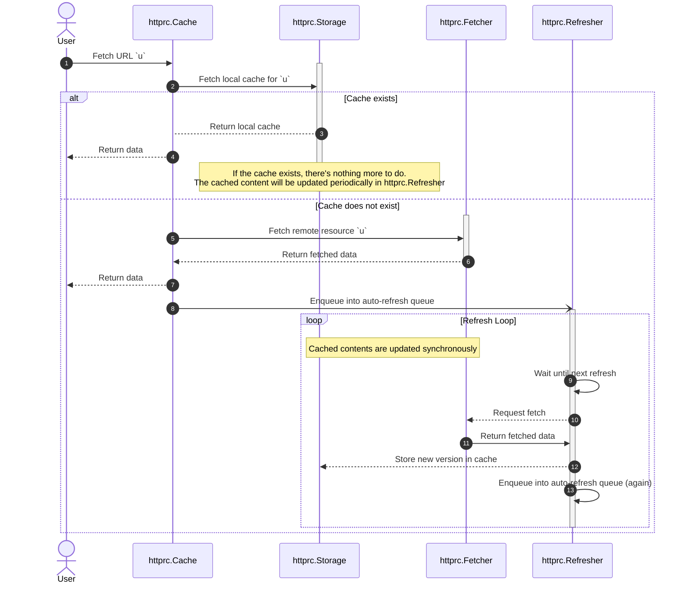

# httprc

`httprc` is a HTTP "Refresh" Cache. Its aim is to cache a remote resource that
can be fetched via HTTP, but keep the cached content up-to-date based on periodic
refreshing.

# SYNOPSIS

<!-- INCLUDE(httprc_example_test.go) -->
```go
package httprc_test

import (
  "context"
  "fmt"
  "net/http"
  "net/http/httptest"
  "sync"
  "time"

  "github.com/lestrrat-go/httprc"
)

const (
  helloWorld   = `Hello World!`
  goodbyeWorld = `Goodbye World!`
)

func ExampleCache() {
  var mu sync.RWMutex

  msg := helloWorld

  srv := httptest.NewTLSServer(http.HandlerFunc(func(w http.ResponseWriter, r *http.Request) {
    w.Header().Set(`Cache-Control`, fmt.Sprintf(`max-age=%d`, 2))
    w.WriteHeader(http.StatusOK)
    mu.RLock()
    fmt.Fprint(w, msg)
    mu.RUnlock()
  }))
  defer srv.Close()

  ctx, cancel := context.WithCancel(context.Background())
  defer cancel()

  errSink := httprc.ErrSinkFunc(func(err error) {
    fmt.Printf("%s\n", err)
  })

  c := httprc.NewCache(ctx,
    httprc.WithErrSink(errSink),
    httprc.WithRefreshWindow(time.Second), // force checks every second
  )

  c.Register(srv.URL,
    httprc.WithHTTPClient(srv.Client()),        // we need client with TLS settings
    httprc.WithMinRefreshInterval(time.Second), // allow max-age=1 (smallest)
  )

  payload, err := c.Get(ctx, srv.URL)
  if err != nil {
    fmt.Printf("%s\n", err)
    return
  }

  if string(payload.([]byte)) != helloWorld {
    fmt.Printf("payload mismatch: %s\n", payload)
    return
  }

  mu.Lock()
  msg = goodbyeWorld
  mu.Unlock()

  time.Sleep(4 * time.Second)

  payload, err = c.Get(ctx, srv.URL)
  if err != nil {
    fmt.Printf("%s\n", err)
    return
  }

  if string(payload.([]byte)) != goodbyeWorld {
    fmt.Printf("payload mismatch: %s\n", payload)
    return
  }

  cancel()

  // OUTPUT:
}
```
source: [httprc_example_test.go](https://github.com/lestrrat-go/jwx/blob/main/httprc_example_test.go)
<!-- END INCLUDE -->

# Sequence Diagram


